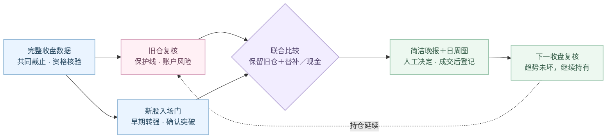

# A 股研究室 · A Share Lab

一组持续跟踪的组合，收盘后看证据，下一交易日由人决定。

当前晚报与连续组合服务使用 `continuous-signal-v1`：**不设强制到期卖出**，
趋势完整就继续持有；确认失效则提示退出，成交与可用现金确认后再评估替补。
它是本地优先的低频研究助手，不连接券商、不自动下单，也不是已经验证盈利的交易系统。

[当前策略合同](docs/CONTINUOUS_STRATEGY.md) · [数据与许可](docs/DATA_POLICY.md) · [旧版完整归档](README_LEGACY.md)

## 从证据到下一次复核



## 入场、持有与补位

- 初次建仓与每只替补都须通过同一新入场门：早期、非过热转强，合格底座后的确认突破或健康回踩。
  接近突破仍只是观察；`ORDERLY_UPTREND` 不冒充 `EARLY_UPTREND`。
- `EARLY_UPTREND` 包含“120 个交易日涨幅不超过 15%”等冻结条件，**只是未验证的研究假设**，
  不等于绝对低点、首次熊转牛，不能预知随后必有主升浪。
- 先由结构确定保护线，再校验计划买价至该线的初始距离不超过 8%；超过就等待，不为凑 8% 抬线。
  条件计划给出最高买价，跳空超限不追；实际成交损失仍可能因跳空、停牌、跌停和费用超过 8%。
- 已持有股票不重新套用新买门，不因排名下降、进入成熟趋势或到期而自动换股。
  保护线只随已确认结构上移，同日重算、切换模型也不降低已有线。
- 每行业最多一只、单股不超过总资金 30%，行业 40% 上限不放宽；组合仍须通过相关性、回撤、尾部风险等门。
  可暂存 0–2 只，但既定单股风险贡献门（基准 45%）不因此豁免；超限先复核，不强行补齐。
- 未确认的 `EXIT` 是条件预案，不是已成交；其资金不能成为正式新买依据。无合格替补或不优于现金就等。

## 仓位口径必须分清

| 对象 | 如何处理 |
|---|---|
| 已有持仓 | 按固定股数与现金重估真实漂移权重；不取整、不擅自再平衡 |
| 初次建仓 | 连续审计目标映射到 **股票仓内** 10% 档，再换算总资金权重 |
| 新增单只替补 | 枚举 **总资金** 10%、20%、30% 档，受可用现金和全部风险门约束 |
| 报告 | 新买仓位标注总资金比例；未核定现金不写成“已空仓” |

真实权重需要完整、明确确认的 `account_snapshot`，不能只凭股票仓内比例猜现金。
快照、公司行动区间证据或持仓身份不完整时暂停补位；字段见[当前合同](docs/CONTINUOUS_STRATEGY.md#账户快照与证据)。

## 搜索范围与收益证据

初建从可用市场数据逐股筛选，再取排名前 36 个候选，用宽度 128 的近似搜索比较 3–5 股组合；
不是全市场全部组合的穷举。后续单只补位则枚举本轮全部已合格替补及各新买档位，与现金一起比较。
“固定旧仓，只补一只”与“所有股票、所有权重自由替换”是两个不同的问题。

当前排序用历史 20 交易日收益置信下界（LCB）代理，不是最高夏普，更不是未来最高收益。
连续持仓、真实成交、费用、分红和现金的账本另行记录；推荐或通知受理不能虚构成交与收益。
严格的时点数据、成本、成交约束及公司行动一致的真实样本外验证尚未完成。单测通过不证明盈利。

## 安装与本地启动

需要 Python 3.12.x。仓库不包含合法授权的完整行情基线，空数据时不会编造推荐。

```bash
git clone https://github.com/zerongwong/a-share-lab.git
cd a-share-lab
python3.12 -m venv .venv
.venv/bin/python -m pip install --upgrade pip
.venv/bin/python -m pip install -e ".[dev]"
.venv/bin/ashare-lab
```

本地界面默认 `127.0.0.1:8501`。合法取得的 CSMAR 数据仅导入本机；
Tushare、BaoStock、AKShare 提供增量与核验适配，来源权限、更新时点和覆盖率仍须通过检查。

```bash
.venv/bin/ashare-import-csmar "/path/to/CSMAR-export" --as-of YYYY-MM-DD
.venv/bin/ashare-sync-daily
.venv/bin/python -m ashare_lab.cli.evening_report
.venv/bin/python -m pytest
```

## 数据更新与微信

收盘后分阶段同步并核验，不把 15:00 到时等同于完整数据已到齐。只有共同截止和质量合格才形成新买计划。
晚报在北京时间周日至周四21:00 首次尝试，21:15、21:30、21:45 有限重试；周五、周六无常规计划。
还必须确认明天确为交易日，节假日不按普通工作日猜测。成功受理的文字不因补图重试而重复发送。

默认仅用 Server 酱；持仓文字披露、R2 私有桶图表发布与通道授权分别校验。
每只持仓配日线与完整周线，图中辅助线保留证据时间边界，不上传成本、股数或账户金额。
密钥只存本机钥匙串；图片失败与文字状态分开，最后失败尝试可发故障提醒。
**服务商受理不等于手机已收到**，定时任务也依赖本机运行与网络可用。

```bash
./scripts/install_evening_report_launchagent.sh
```

安装计划任务需使用者主动执行。停止自动晚报时可卸载独立任务，不删除研究数据：

```bash
./scripts/uninstall_evening_report_launchagent.sh
```

完整历史安装及排障步骤保存在 [README 归档](README_LEGACY.md)。

## 开发与兼容边界

核心模块：[入场合同](src/ashare_lab/analytics/continuous_signals.py)、[锁仓补位](src/ashare_lab/analytics/continuous_portfolio.py)、
[连续计划](src/ashare_lab/services/build_continuous_digest.py)、[独立净值记录](src/ashare_lab/services/continuous_strategy_journal.py)。
旧六期限及 MCP `generate_portfolio` 保留为固定期限对照，不是当前连续组合生产入口；历史推荐与到期记录不改写。
原始行情、账户快照、私有报告、数据库、密钥和签名图片地址不得提交 GitHub。
