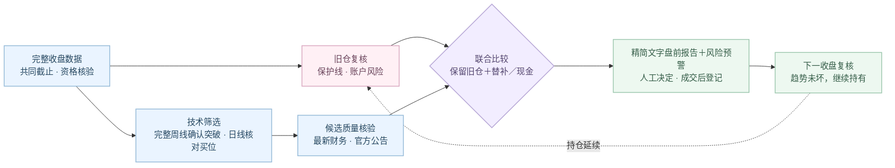

# A 股研究室 · A Share Lab

一组持续跟踪的组合，收盘后核验证据，下一交易日盘前由人决定。

当前盘前报告与连续组合服务使用 `continuous-signal-v4`：**不设强制到期卖出**，
趋势完整就继续持有；确认失效则提示退出，成交与可用现金确认后再评估替补。
它是本地优先的低频研究助手，不连接券商、不自动下单，也不是已经验证盈利的交易系统。

[当前策略合同](docs/CONTINUOUS_STRATEGY.md) · [财务公告正文审阅](docs/CANDIDATE_REVIEW.md) · [数据与许可](docs/DATA_POLICY.md) · [旧版完整归档](README_LEGACY.md)

[v4 实施核验与未完成项](docs/CONTINUOUS_V4_ACCEPTANCE.md)：真实行情试跑已完成，公告正文无人值守审核仍是未完成环节。

新增：[马克斯周期风险层（影子运行）](docs/MARKS_CYCLE_SHADOW.md) · [免费数据超时与备用恢复](docs/FREE_DATA_RECOVERY.md)。
周期层只做本地对比，四类时点证据未齐时明确等待，不改变生产仓位；推送仍为精简文字。

## 从证据到下一次复核



## 入场、持有与补位

- 初次建仓与每只替补都须通过同一新入场门：**已完成周线同时确认上行方向和底座突破或健康回踩**，
  完整日线再核对当前买入位置与结构是否仍有效；不是只靠周均线上行，也不要求再出现第二次独立日线突破。
  接近突破仍只是观察；盘中穿越和未完成周线不能确认周线结构。
- 周线突破/健康回踩和日线执行位置均合格时，底部区间扭转、`EARLY_UPTREND` 与未过度延伸的 `ORDERLY_UPTREND` 均可继续核验。
  早期位置只是小幅排名加分；“120 个交易日涨幅不超过 15%”不再一票否决。
  过度延伸、末端加速和抛物线上涨仍为硬排除。
- 技术筛选后，再核对候选的最新已披露财务业绩与官方公告。财务质量或公告风险不合格的不进入组合；
  证据缺失只记待核验，不能当作绩优股或直接放行，也不因题材热度替代业绩证据。
- 结构保护距离是风险信息，不再仅因超过 8% 就否决新买；也不为了凑 8% 人为抬高结构线。
  合理买位、过度延伸、可成交性和组合风险门仍须满足，计划买价上限不是任意追价许可。
- 已持仓另设独立成本止损：确认成本 × 92%，触及即在盘前报告优先预警；结构先失效可更早退出。
  触线后反弹不自动解除警报，除权/分红待核验会明确报警；不是自动止损成交保证。
- 可启用[盘中一分钟风险监控](docs/INTRADAY_RISK_MONITOR.md)：只检查已确认持仓，成本触线或结构触线即尝试发 Server酱。
  结构触线不冒充收盘确认；行情过期/断线报警，推荐不视为成交。需要本机开机联网，不保证瞬时送达。
- 经使用者另行授权后，公司行动核验每天仅向巨潮资讯提交仍有效持仓的六位股票代码；
  不提交名称、成本、股数、金额、权重、入场日、组合编号或保护线。完整结果分为“无事件 / 已发现 / 未知”，
  任何超时、字段漂移或身份不一致都按未知处理，不会把未知冒充安全，也不会阻断整份盘前报告。
- 已持有股票不重新套用新买门，不因排名下降、进入成熟趋势或到期而自动换股。
  保护线只随已确认结构上移，同日重算、切换模型也不降低已有线。
- 组合为 **0–5 只**：所有合格的 1–5 股方案共同参与风险与收益比较，不优先凑成 3–5 股。
  1–2 股是有效的低敞口集中配置，不是只能在大组合失败后使用的过渡方案；无合格改善就留现金。
- 每行业最多一只；每个新建仓的单股总账户权重硬上限为 20%，以约 15% 为常态中枢，但不要求每只精确等于 15%。
  组合仍须通过适用的周期敞口、相关性、回撤、尾部风险和风险贡献等门；单股相关性以及
  1–2股组合的归一化单股风险贡献不作为分散门，程序明确标为不适用，并以低敞口和单股上限约束集中风险。
- 未确认的 `EXIT` 是条件预案，不是已成交；其资金不能成为正式新买依据。无合格替补或不优于现金就等。

## 仓位口径必须分清

| 对象 | 如何处理 |
|---|---|
| 已有持仓 | 按固定股数与现金重估真实漂移权重；不取整、不擅自再平衡 |
| 初次建仓 | 连续审计目标映射到 **股票仓内** 10% 档，再换算总账户权重并执行单股 20% 硬上限 |
| 新增单只替补 | 枚举 **总账户** 10%、20% 档，约 15% 只是研究中枢；仍受可用现金和全部风险门约束 |
| 报告 | 新买仓位标注总资金比例；未核定现金不写成“已空仓” |

真实权重需要完整、明确确认的 `account_snapshot`，不能只凭股票仓内比例猜现金。
快照、公司行动区间证据或持仓身份不完整时暂停补位；字段见[当前合同](docs/CONTINUOUS_STRATEGY.md#账户快照与证据)。

## 搜索范围与收益证据

初建从可用市场数据筛出周线突破候选，对排序前36个候选限时核对财务、公告和执行证据，再从通过者中，
用宽度128的近似搜索共同比较1–5股方案与现金基准；
不是全市场全部组合的穷举。后续单只补位则枚举本轮全部已合格替补及各新买档位，与现金一起比较。
“固定旧仓，只补一只”与“所有股票、所有权重自由替换”是两个不同的问题。

报告单独保留最多5只排序靠前的技术研究候选，不让组合优化或现金决策隐藏已确认形态。
“重点候选”不是买入许可：财务、公告、可成交性待核验或组合风险不合格都会标明，不分配新买权重。
新核验链包含财务数值质量检查和官方公告清单、正文审阅证据；公告清单成功返回不等于正文审阅完成，
缺少任何必要证据仍为未知。该流程仍需实盘数据验收，不能宣称已完成全自动尽调，也不能把待核验误称为没有强股。
财报期、数据源报告的公布日、公告清单发布时间、抓取时刻分别保存；尚未建成完整的历史更正链。“最新”指在决策时已披露的最新适用财报，
不是把当前修订报表倒填到过去。CSMAR 资产负债表快照不是完整利润、现金流或公告核验的替代。

当前排序用历史 20 交易日收益置信下界（LCB）代理，不是最高夏普，更不是未来最高收益。
连续持仓、真实成交、费用、分红和现金的账本另行记录；推荐或通知受理不能虚构成交与收益。
v2 数据库迁移不推断卖出、不自动清空任何活跃持仓；开源使用者必须在确认已空仓后显式记录 `cleared` revision。
本机这次切换已通过该显式空仓 revision 停用旧活跃跟踪；历史持仓、决策、通知和绩效审计不删除也不改写。
只有使用者下一次明确确认真实建仓，才创建新 revision、新 `position_key` 与隔离的连续追踪身份；
真实绩效链还必须从完整、明确确认的账户估值快照开始，不能由推荐或通知推测成交后自动生成。
严格的时点数据、成本、成交约束及公司行动一致的真实样本外验证尚未完成。单测通过不证明盈利。

## 安装与本地启动

需要 Python 3.12.x。仓库不包含合法授权的完整行情基线，空数据时不会编造推荐。

```bash
git clone https://github.com/zerongwong/a-share-lab.git
cd a-share-lab
python3.12 -m venv .venv
.venv/bin/python -m pip install --upgrade pip
.venv/bin/python -m pip install -e ".[dev]"
.venv/bin/ashare-lab
```

本地界面默认 `127.0.0.1:8501`。合法取得的 CSMAR 数据仅导入本机；
Tushare、BaoStock、AKShare 提供增量与核验适配，来源权限、更新时点和覆盖率仍须通过检查。

```bash
.venv/bin/ashare-import-csmar "/path/to/CSMAR-export" --as-of YYYY-MM-DD
.venv/bin/ashare-sync-daily
.venv/bin/python -m ashare_lab.cli.evening_report
.venv/bin/python -m ashare_lab.cli.company_actions authorize --yes
.venv/bin/python -m pytest
```

## 数据更新与微信

收盘后先分阶段同步，次日 06:30、07:30、08:20、08:40 再补齐并核验；不把 15:00 到时等同于完整数据已到齐。
盘前报告在北京时间周一至周五08:45 首次尝试，08:55、09:05、09:20 有限重试，目标在09:00前完成，并在09:30开盘前关闭自动提交窗口。
程序还必须确认当天是否交易日，节假日不按普通工作日猜测；只有上一完整交易日的共同截止和质量全部合格，才形成当天计划。
成功受理的文字不会因重试而重复发送。

默认仅用 Server 酱；盘前报告生产路径只发送精简文字和持仓预警，不上传或发送图片，也不需要
开通 Cloudflare R2。持仓文字披露与通道授权仍分别校验；历史图表配置仅为兼容保留。
密钥只存本机钥匙串；文字失败会按既有窗口重试并记录故障提醒。
**服务商受理不等于手机已收到**，定时任务也依赖本机运行与网络可用。

```bash
./scripts/install_daily_sync_launchagent.sh
./scripts/install_evening_report_launchagent.sh
```

安装计划任务需使用者主动执行。停止自动盘前报告时可卸载独立任务，不删除研究数据：

```bash
./scripts/uninstall_evening_report_launchagent.sh
```

完整历史安装及排障步骤保存在 [README 归档](README_LEGACY.md)。

## 开发与兼容边界

核心模块：[入场合同](src/ashare_lab/analytics/continuous_signals.py)、[锁仓补位](src/ashare_lab/analytics/continuous_portfolio.py)、
[连续计划](src/ashare_lab/services/build_continuous_digest.py)、[独立净值记录](src/ashare_lab/services/continuous_strategy_journal.py)。
旧六期限及 MCP `generate_portfolio` 的 3–5 股搜索只保留为固定期限历史对照，不是当前连续组合生产入口；
冻结的历史推荐不改写；显式离线审计只可追加派生结算记录。自 2026-09-18 起，生产同步不再
结算、复盘或推送这些旧组合，
旧月度复盘也不再自动运行；只有当前 `continuous-signal-v4` 可生成新计划。当前持仓为空时，
程序保持等待，直至使用者明确确认一次新的真实建仓后才建立新的持仓追踪身份。
原始行情、账户快照、私有报告、数据库、密钥和签名图片地址不得提交 GitHub。
