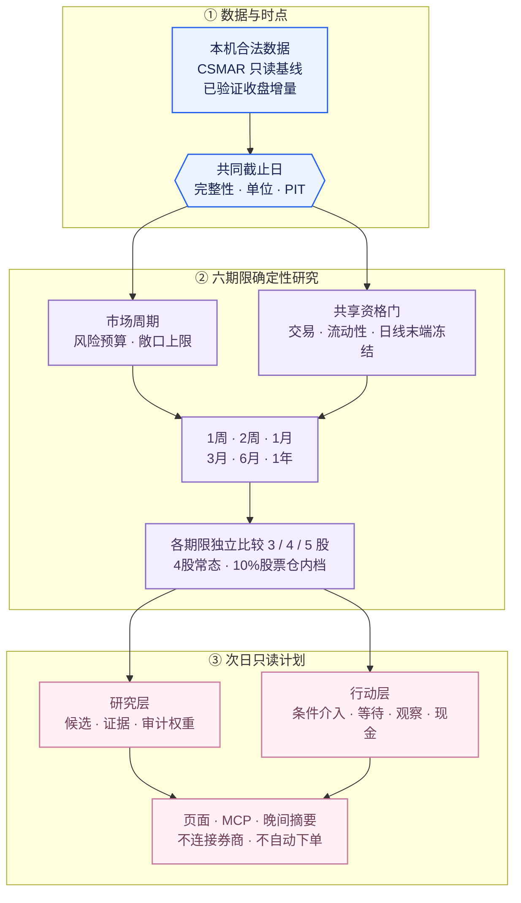
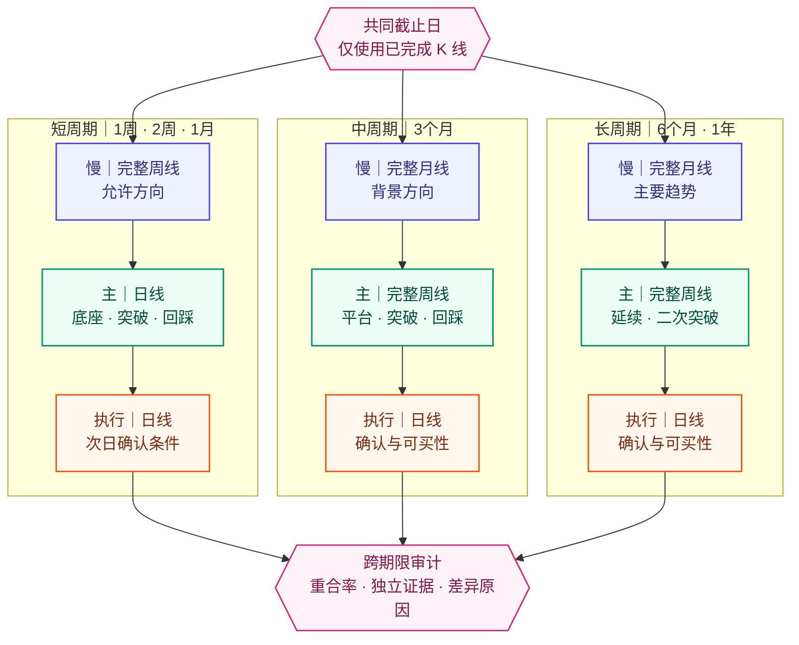
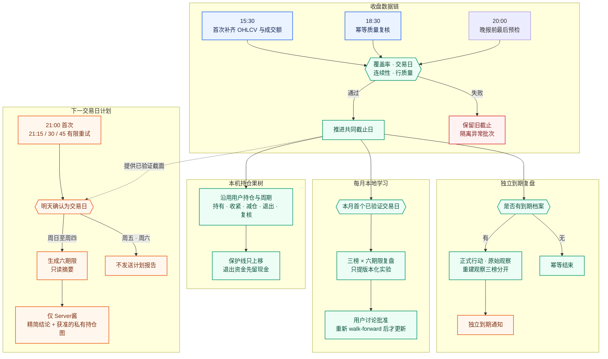

# 旧版 README 归档

> 归档，不是当前生产合同。以下完整保留改版前的六期限方法、安装说明和运行历史；
> “当前”“主模型”等表述均指旧版当时的状态。当前连续组合以
> [新版首页](README.md)及[连续组合合同](docs/CONTINUOUS_STRATEGY.md)为准。
> 不应依据本归档启用旧参数、改写新策略或重解释已经冻结的历史推荐。

---

# A股研究室（A Share Lab）

A Share Lab 是一个本地优先、证据优先的 A 股中期研究项目。主流程面向 **1 周到 1 年**
的持有期，默认使用 **3 个月（13 周）**，通常用于 1–3 个月的组合研究。它从用户合法
取得并保存在本机的数据中，以完整周线/月线判断方向、以期限主周期识别结构、以日线生成
介入条件，再分别比较六个期限下的 3、4、5 股组合与权重，同时保留现金并显示数据截止、
排除原因和下行风险。

项目不连接券商、不自动下单、不承诺收益，也不把历史重叠窗口统计表述成未来概率。
尾盘打板、日内高抛低吸和实时交易监控不属于当前主产品；相关实验代码即使仍在源码中，
也不会在主导航中启用。

**当前定位：低频研究与人工决策辅助，不是已经验证盈利的自动交易系统。**
完整样本外回放、公司行为一致价格、交易日历与持仓保护线闭环仍有待完成的验收项。
测试通过只说明相应软件行为正确，不能证明选股有超额收益。见
[2026-09-05 全流程审视与修订边界](docs/PROJECT_REVIEW_2026_09.md)。

如果使用者在本机明确登记当前持仓与计划周期，程序会在每个已验证收盘后继续复核同一组
持仓；在使用者再次明确替换或清空之前，模型不能擅自改动成员或周期。这个“果树修枝”
流程是收盘后的研究行动单，不读取券商账户，也不自动卖出、补股或调仓。

对于明确登记的 **1–5 只、1 个月周期**持仓，晚报可以在获准通道下生成一张手机优先的纵向
复合图：每只股票一张日线和一张仅含完整周线的周线，四只仍为 8 个面板。图中以低饱和粉、紫、
蓝组织层次，同时保留 A 股红涨绿跌；只展示模型原观察条件、均线、量能、确认基准和保护
参考或有效保护线，不展示成本、股数、金额或账户权重。历史重建的原观察条件会明确标为
“非行动、非买入许可”；辅助线只从当时可知日期开始，不向历史回画，未完成周线不会参与
判断。

## 设计原则

- 数据和确定性规则负责计算，模型只负责解释证据；
- 财务和公告必须按实际披露时间使用，不能用会计期末日代替可知时间；
- 缺失因子保持缺失并降低覆盖度，不能填成“中性 0.5”；
- ST、退市、停牌、形成日不可买、数据不足和走势过热可以让结果为空；
- 数据不足、市场偏弱和个股暂不可介入是三个不同状态；`DATA_NOT_READY` 只表示数据问题；
- 只要数据合格就继续筛选；个股硬门至少通过 3 只时展示 3–5 只研究候选，市场周期只调整
  介入门、风险预算和总敞口；
- 每次研究记录数据截止、规则版本、输入哈希、风险提示和失效条件；
- 原始预测不可事后改写，真实结果写入独立记录；
- 当前持仓只由使用者显式更新；候选排名变化不能自动换掉健康持仓；
- 保护线只能随确认结构上移，减仓或退出后的资金先留现金，不向亏损仓摊低；
- 新买点先找有依据的结构保护线，再校验计划买价至该线的距离不超过 8%；风险过大就
  等待或放弃，不把保护线人为抬到正常波动中。条件计划同时给最高买价，跳空超过不追；
- 融资默认关闭，不自动加杠杆，也不向亏损仓摊低成本。

## 当前主模型

当前主入口已经收敛为一条可解释的研究链：

1. 先统一股票、指数和可选证据的共同截止日，再执行数据质量、交易资格、流动性和末端
   加速等共享硬门；市场价格周期在同一截面独立计算；
2. 对 1 周、2 周、1 个月、3 个月、6 个月和 1 年六个期限并行研究，不再把一套日线信号
   简单复制到所有期限；
3. 每个期限都按“慢周期定方向、主周期识别底座与突破、日线负责实际介入确认”的嵌套结构
   独立计算；长期期限的结构失效与减仓复核优先引用主结构周期，不用一条共享日线替代；
4. 短周期以周线为背景、日线为主结构；3 个月以月线为背景、周线为主结构；6 个月和
   1 年由月线确定主要趋势、周线验证延续或二次突破。所有期限最后都回到日线生成条件价；
5. 当前先用共享日线末端加速硬门冻结新介入，再结合各期限的结构状态和日线执行
   `EXTENDED` 状态筛选；尚未校准的周/月主周期过热阈值不会冒充已实现规则；
6. 财务、官方公告和次日可执行性只作 `PASS / VETO / UNKNOWN` 风险门；只要最终标的仍有
   `UNKNOWN`，结果就降为 `VALIDATION_NOT_READY` 临时候选，不是最终买入清单；
7. 每个期限分别排序候选、分别搜索风险可行的 3、4、5 股组合，并按“逆下行波动 ×
   有界信号倾斜”生成连续审计权重和 10% 股票仓内操作档；
8. 同时约束年化下行波动、滚动回撤严重度 P90、5 日 ES95、下跌相关性、
   单股下行风险贡献和行业集中度；
9. 市场周期层只调整介入确认标准、下行风险预算和最大股票敞口；候选会标记为
   `CONDITIONAL_ENTRY`、`WAIT_CONFIRMATION` 或 `OBSERVE_ONLY`，立即可介入数量可以为 0；
10. 风险预算内比较对应持有期的历史收益下界；数据缺陷才返回 `DATA_NOT_READY`，模型尚未验证或
   证据不足则返回 `VALIDATION_NOT_READY`，证据齐全也只称 `RESEARCH_ONLY`；
11. 对使用者明确登记的现有持仓，另行运行有记忆的 `HOLD / TIGHTEN / REDUCE / EXIT /
   REVIEW` 收盘复核；它不重新生成整组持仓，也不因今日排名变化而高换手。

不同期限出现同一只股票并不天然错误：只有它在每个期限都独立通过相应的慢周期方向、
主周期结构、日线执行和组合风险门时，才称为多周期共振。系统不会为了让六张表看起来
不同而强行加入次优股票；报告应同时说明各期限的独立依据与组合重合度。

4 只研究候选是注意力与分散的常态。候选数量与实际部署数量分开：3、4、5 只组合在周期
调整前的股票敞口上限分别为 70%、80%、85%，周期层只能下调不能上调；没有可介入标的时
可以保持全部现金。5 只只有在历史收益下界更高、路径与尾部风险不恶化且下跌相关性或
单股风险贡献得到实质改善时，才替代四股常态。融资始终为 0，不为凑数加入次优股票。

这是一份“双层合同”：个股层负责回答“哪些股票最值得研究”，周期层负责回答“当前应以
多大风险预算、什么确认条件参与”。价格周期偏弱不会再被解释成数据未就绪，也不会阻止
候选发现；它可以让全部候选处于“等待确认”或“仅观察”，并把实际敞口降为 0。

为了不让“候选已生成”只剩下一排横线，系统还会将已完成结构计算但未通过风险或收益下界的
最接近四股组合单独显示为“候选观察方案”：只给出观察池内 10% 整数档配比和对应期限的
日线价格观察条件，
不换算总资金仓位，不进入行动层。观察线被触及也不等于可以买入。

完整公式、Edwards–Magee 与 Livermore 的使用位置、证据否决层和验证要求见
[中期选股与组合方法](docs/STRATEGY.md)，程序分层见 [架构](docs/ARCHITECTURE.md)，
第三方数据边界见 [数据与许可政策](docs/DATA_POLICY.md)，晚间微信报告的内容和安全边界见
[21:00 次日研究报告](docs/EVENING_REPORT.md)，六周期发布计划如何到期复核见
[滚动绩效追踪](docs/PERFORMANCE_TRACKING.md)，每月如何从成熟样本提出而不自动采用模型实验见
[月度模型复盘](docs/MONTHLY_MODEL_REVIEW.md)。

## 方法细节与旧版兼容边界

以下内容说明当前动态 3–5 股主模型的实际方法，同时标出早期 `3:2:2:1` 固定四股原型
仍然保留的兼容边界。旧固定权重只用于复核旧档案与兼容测试；当前网页和 MCP 的
`generate_portfolio` 不再使用它。

### 研究目标

本项目不是涨幅榜、追涨模型或“预测明天上涨概率”的模型。当前目标是：在数据完整、能够
交易且市场环境已经说明的前提下，从同一截止日的 A 股样本中，寻找 **趋势相对健康、
下行风险相对可控、历史单位风险收益较好、彼此不过度同涨同跌** 的 3–5 只股票，组成便于
跟踪的研究组合；4 只是注意力常态，不足时保留现金，改善分散时才增加到 5 只。

系统优化的是透明的风险调整综合分和组合约束，不是单纯追求过去收益最高。它也不是
对全部组合进行穷举并求得数学意义上的“全市场最大 Sharpe / 最小回撤”唯一解。当前
实现先对合格股票作横截面排序，再从高分候选池中搜索满足相关性和行业约束的组合。

#### 从数据到次日计划



#### 六期限不是六份相同的日线排名



月线或周线负责方向和结构，不直接替代可执行价格；所有期限都用日线生成条件介入线，
而长期期限的结构失效线和减仓复核条件优先来自主结构周期。周中、月中尚未收完的 K 线
不能用来确认突破。若这一层没有
可用的官方交易日历，程序按周五和工作月末保守确认完成周期；遇到节假日缩短的交易周或
特殊休市月，周线/月线可能晚一个确认点，而不会提前把局部 K 线当成完整突破。

#### 自动更新与推送



CSMAR 原始文件和本地研究数据库始终留在使用者自己的电脑，不上传 GitHub，也不通过通知
通道发送。自动化只更新数据、计算并推送研究摘要，不连接券商账户，不会自动下单。

### 第一步：先确认数据能不能支持今天的研究

- 所有股票必须使用同一个实际截止日；某只股票缺少截止日收盘价就排除；
- “当前研究”至少要覆盖上一完整工作日，陈旧数据不会冒充今天的结果；
- 全市场共享资格基线至少需要 252 个日线价格点；6 个月和 1 年还要分别满足更深的
  期限结构历史，不能用短历史伪造完整周线或月线趋势；
- 组合风险所需的深历史只对已经通过期限结构门的候选逐股核验，不把 2,017 个价格点
  错当成 5,000 多只股票都必须满足的全市场覆盖门；
- 默认要求近 20 日成交额中位数不低于 2,000 万元；
- 未复权原始价格窗口内若出现超过 45% 的异常单日跳变，当前实现先排除而不是擅自修复；
- 价格、单位、日期或衍生指标异常时直接排除，不用猜测值补齐；
- 财务、新闻等可选因子缺失时保持缺失，不填入“中性 0.5”。

历史要求分为“全市场资格”和“候选风险复核”两层，数值均为至少需要的日线价格点：

| 持有期 | 全市场资格与结构门 | 结构合格候选的风险历史 |
|---|---:|---:|
| 1 周 | 252 | 252 |
| 2 周 | 252 | 252 |
| 1 个月 | 252 | 252 |
| 3 个月 | 252 | 481 |
| 6 个月 | 280 | 961 |
| 1 年 | 540 | 2,017 |

数据读取会在这些最低值之外保留 70 个交易日的日历与对齐缓冲；缓冲不是新的证券资格门。
这种分层让短历史股票可以从长期风险组合中被单独排除，而不会把整个期限误报成
`DATA_NOT_READY`。

如果数据太旧、共同截止日无法确认或关键来源不一致，系统返回 `DATA_NOT_READY`，而不是
降低标准凑出一个组合。

### 第二步：判断价格周期，用来校准风险而不是停止研究

市场环境不是某只股票的加分项，也不是候选发现的总开关。系统分别计算两套相互独立的
价格证据：

1. **全市场宽度**：统计合格股票位于 MA20、MA60、MA120 之上的比例，以及全市场
   20/60 日收益中位数；
2. **核心指数确认**：在相同截止日观察主要 A 股指数的 MA20/60/120、20/60 日收益、
   60 日波动和 120 日回撤。

当数据齐全时，无论全市场宽度或核心指数是否 `risk_off`，个股筛选和候选排序都继续运行。
`risk_off` 只会收紧介入确认、降低风险预算与最大股票敞口；因此可以有 3–5 只候选而
立即可介入数量为 0。只有核心指数证据过期、错位、缺失或来源不合规时，才属于
`DATA_NOT_READY`。

当前周期层只是**价格周期代理**。它使用全市场 MA20 宽度与 20 日收益中位数，以及核心
指数 MA20/MA60/MA120 宽度、20/60 日收益、60 日年化波动和 120 日回撤。当前代码有
五个可用状态和一个数据不可用状态；中文标签、股票敞口上限和介入严格度如下：

| 代码状态 | 页面标签 | 股票敞口上限 | 介入严格度 |
|---|---|---:|---|
| `UPTREND_EXPANSION` | 中期上行｜短线增强 | 80% | `STANDARD` |
| `UPTREND_PULLBACK` | 中期上行｜短线回撤或分化 | 60% | `TIGHT` |
| `TRANSITION_RECOVERY` | 中期过渡｜复苏尝试或证据混合 | 50% | `TIGHT` |
| `DOWNTREND_REPAIR` | 中期下行｜短线修复反弹 | 30% | `DEFENSIVE` |
| `DOWNTREND_PRESSURE` | 中期下行｜短线压力 | 20% | `EXCEPTION_ONLY` |
| `UNAVAILABLE` | 价格周期数据不可用 | 0% | `UNAVAILABLE` |

这是按单个共同截止日运行的确定性分类，`confidence` 是规则一致度，不是未来方向概率。
当前版本**没有实现**跨日状态持久化或迟滞，也尚未接入霍华德·马克斯所讨论的完整经济、
企业盈利、信贷供给、估值与投资者心理周期，因此不能声称已经判断了牛熊起点、终点、
持续时间或幅度。

### 第三步：先过共享硬门，再按期限独立确认结构

下列条件会在评分前排除股票：

| 硬门 | 当前规则 |
|---|---|
| 基础资格 | ST/*ST、退市标记、停牌、明确不可买入、行业信息缺失 |
| 形成日可执行性 | 形成日收于涨停默认排除，等待以后独立确认可成交性 |
| 历史与质量 | 历史不足、截止日缺失、价格或收益非有限值、流动性不足 |
| 完整 K 线 | 周线和月线只使用已收完的周期，不能用周中或月中的局部 K 线确认突破 |
| 期限结构 | 在所选期限内独立通过慢周期方向、主周期底座/突破和日线执行门 |
| 共享日线 5/20 日垂直加速 | 5 日涨幅超过 25%，同时 20 日涨幅超过 35% |
| 共享日线 20 日末端加速 | 20 日涨幅超过 35%，同时价格高于 MA20 超过 15% |
| 共享日线 60 日末端加速 | 60 日涨幅超过 70%、高于 MA60 超过 28%，且 20 日涨幅超过 12% |
| 共享日线 120 日抛物线延伸 | 120 日涨幅超过 120%、高于 MA120 超过 45%，且 20 日涨幅超过 20% |

这些是当前运行时的**共享日线末端冻结规则**，用于冻结新介入，而不是武断地判定一家公司
已经变坏。各期限另外保存慢周期、主结构和日线执行状态；日线执行标为 `EXTENDED` 时同样
不会进入可介入状态。类似连续涨停、
短期垂直拉升并严重远离均线的股票，即使历史动量很高，也不会因为高分重新进入组合；
要等新的整理平台形成后再研究。尚未经过点时校准的周线/月线末端过热阈值目前**没有**加入
硬门，因此不能把上述共享日线规则称为“每个期限独立的主周期成熟度门”。

### 第四步：在同一截面内进行透明评分

通过硬门的股票会在合格样本内转换为 0–1 的百分位分数。百分位代表相对名次，不是上涨
概率，也不是未来收益预测。

| 维度 | 当前计算方法 | 作用 |
|---|---|---|
| 下行风险 | 最大回撤与 CVaR95 百分位的平均 | 偏好历史回撤和尾部损失相对较小的股票 |
| 风险调整收益 | Sharpe 与 Sortino 百分位的平均 | 比较相似风险下的历史收益质量 |
| 期限专属趋势收益代理 | 按所选期限组合短、中、长窗口，不用短期暴涨外推一年 | 观察相应期限的趋势延续性，不叫未来预期收益 |
| 多周期趋势阶段 | 已完成慢周期方向 + 主周期底座/突破 + 日线执行状态 | 偏好方向与结构一致，惩罚震荡、下跌和过度延伸 |
| 流动性 | 近 20 日成交额的全市场相对分位 | 降低难以正常成交的标的权重 |
| 完整基本面 | 只有真实披露时点和合格样本完整覆盖时才启用 | 目标是增长、盈利、现金流、杠杆和估值质量 |
| 资产负债表稳健度 | 当前快照下的资本、营运资金、现金和资金占用 | 只是窄因子，不冒充完整基本面 |
| 新闻与板块 | 只有来源、发布时间和合格样本覆盖完整时才启用 | 防止搜索偏差和事后挑选利好 |

当前平衡型配置的相对系数为：下行风险 25、风险调整收益 20、趋势收益代理 20、完整
基本面 12、流动性 5、趋势阶段 4、新闻 2、板块 2；资产负债表窄因子的系数只取完整
基本面的一半。它们不是固定的最终百分比：任何可选因子没有完整覆盖时都会被禁用，缺失
权重会在当轮真实可用的因子之间重新归一化。趋势收益代理和趋势阶段的底层证据会随期限
切换，不会把同一组日线值复制六次。组合搜索阶段另外保留 10 分用于分散度。

### 第五步：不是简单拿排行榜前四名

个股基础分形成后，程序从机器排序靠前的计算池中，分别搜索 3、4、5 股组合；搜索使用
有界的确定性 beam search，因此属于可审计的计算近似，并非对全市场所有组合穷举。当前
主模型同时约束：

- 任意两只股票至少要有 60 个共同交易日；
- 两只股票的历史相关系数不得超过 0.75；
- 单一行业权重不得超过当期周期政策给出的上限；周期越弱，上限越低；
- 分散度由低相关性和跨行业程度共同计算；
- 每个组合都必须通过下行波动、滚动回撤、5 日 ES、下跌相关性和单股下行风险贡献预算；
- 如果没有任何 3–5 股组合满足约束，行动层保持现金，不放宽条件凑数。

因此最终 3–5 只不一定是个股基础分的前几名。程序寻找的是一个可解释、约束合格的组合，
而不是近期涨幅最大的几只股票。即使财务、公告或当前介入条件尚未通过，程序仍可先形成
一个带自动权重的“研究风险组合”；全精度 `research_weight` 是相对总资金的连续审计
目标，也是生成 10% 操作档的依据，但不用于最终风险指标，不是当前持仓。

### 第六步：马克斯、麦吉与利弗莫尔分别用在哪里

理论不会替代数据，也不会由语言模型主观“看图讲故事”。当前代码分两层使用：

**市场风险姿态层**

- 霍华德·马克斯的周期思想用于理解“过度与修正”，以及在进攻和防守之间校准风险姿态；
- 它不负责给个股排名，不提供精确择时，也不能因为市场偏弱而把强势个股候选删除；
- 当前实现只有价格周期代理，不是完整的马克斯经济、信贷和心理周期模型。可参见橡树资本
  [Taking the Temperature](https://www.oaktreecapital.com/insights/memo/taking-the-temperature)
  与 [You Can't Predict. You Can Prepare.](https://www.oaktreecapital.com/insights/memo/you-can%27t-predict.-you-can-prepare)。

**全市场筛选层**

- 艾德华兹–麦吉负责个股的主次趋势、平台、突破、失败突破、量能确认和阶段成熟度；
- 按持有期分别使用已完成的日线、周线和月线：慢周期定方向，主周期识别结构，日线执行；
- 把有序上涨、早期上涨、震荡、下跌、延伸和抛物线加速转译为确定性状态；
- 当前硬门是共享日线末端加速冻结，并结合期限结构状态与日线执行 `EXTENDED`；专门的
  周线/月线末端成熟度门仍待点时校准，尚未加入主流程。

**入选后的关键价位层**

- 用已经得到右侧确认的高低点识别支撑和阻力，避免把尚未确认的转折点偷带进历史；
- 用收盘价而非盘中瞬间越线确认突破；有成交量数据时，突破量至少达到 20 日中位数的
  1.2 倍；
- 用 ATR 只做波动缓冲，生成回踩观察区、突破确认线、结构失效位和分段减仓区；
- 利弗莫尔规则体现在“等待关键点确认、只向盈利仓加码、不向亏损仓摊低成本”。

**持仓后的果树修枝层**

- 使用者明确登记整组持仓、入场日和计划周期；这份声明会持续有效，模型不能根据每日榜单
  自行换股；
- 每个已验证收盘后，短周期按日线、3–6 个月按完整周线、1 年按月线方向与周线结构复核，
  日线只负责收盘确认和下一可成交时段的执行提示；
- 麦吉启发式保护线取入场后经过右侧确认的反应低点并加入 ATR 缓冲；在新基准点出现后只
  能上移，数据库也会拒绝任何下移；
- 健康或尚未确认转弱的股票继续持有，不因一天收阴或相对排名下降就卖出；确认转弱才提示
  减仓，完整收盘跌破有效保护线才提示退出；
- 原始价格未复权且缺少独立公司行动核验时，疑似收紧、减仓或退出会改为紧急“复核”，
  防止把除权、送转或配股的机械跳空误当成趋势破位；
- 所有动作都是次一可成交时段的研究提示；退出权重留作现金，不自动补股、不自动下单。

需要特别说明：这是一套版本化的 **Edwards–Magee-inspired** 研究默认值，不声称逐字复现
某一版书中第 28 章的完整基准点算法，也没有被 A 股样本外数据证明为“最有效”。若要做
忠实规则转译，还需要完整章节中的基准点确认、过滤幅度、触发方式和例外说明。利弗莫尔的
“买强不买弱、只向盈利仓加码、不向亏损仓摊低”是执行纪律，不作为额外主观分数加入排名。

### 第七步：当前自动化范围与尚未完成的部分

README 区分“已经自动运行”与“目标研究框架”，避免把规划写成现状：

当前多周期计算已经接入全市场筛选、组合服务、网页、MCP 和晚间摘要；运行链路可以工作，
但中央合同状态仍是 **`integration_pending`**，单次运行应视为 `partial_multiframe`，不能写成
`integrated/research_validation_pending`。
以 2026-08-27 为共同截止日的真实本地验收中，六个期限均完成数据门并产生了有明显差异的
候选。这次验收是只读的，只证明 core → service → UI/MCP/digest 的数据分层和期限路由已经
接通，不证明归档合同完整，也不证明未来收益、胜率或风险控制有效。

| 层次 | 当前状态 |
|---|---|
| CSMAR 量价、风险、趋势、流动性 | 已进入全市场自动筛选 |
| 六期限多周期运行链 | 已接入 core、service、UI、MCP 与晚间摘要；组件方法版本 `multi-timeframe-core-v0.2.0`，中央合同仍为 `integration_pending` |
| 全市场宽度与核心指数价格周期证据 | 已自动运行；单截面确定性分类，无跨日持久化/迟滞，不是完整马克斯周期 |
| 资产负债表稳健度 | 仅可作为取得日之后的当前窄因子；历史回放禁用 |
| 完整利润、现金流、成长、估值质量 | 尚缺完整点时数据，当前主评分未启用 |
| 全市场新闻、公告与板块催化评分 | 尚未自动接入，当前主评分通常禁用 |
| LongBridge 当前行情/新闻/财务 | 只在 Codex 深度研究时用于最终候选只读核验，未进入主页面批量评分 |
| TradingAgents 多智能体辩论 | 主组合不依赖原图；只保留牛方、熊方、数据质量和组合风险复核思想 |
| 完整周/月边界 | 当前缺少点时官方交易日历边界，采用周五/工作月末保守回退，属于部分实现 |
| 不可变逐运行归档 | 尚未把六期限完整截止、结构/风险/LCB/价位和重合归因写入同一不可变运行档案 |
| 周/月末端成熟度门 | 尚未实现经校准的主周期过热硬门；当前只有共享日线末端冻结 + 期限结构/日线 `EXTENDED` |
| 严格 walk-forward 样本外验证 | 尚未达到生产声明标准，当前指标只能称历史描述 |
| 本机当前持仓账本与收盘修枝 | 已接入；用户显式更新前持续沿用，保护线单调上移，默认不外发、不下单 |
| 每月模型复盘 | 已接入本机自动生成；三榜六期限分开，只提版本化实验，不自动改参数 |

只有在点时官方交易日历完成周/月边界、六期限证据的不可变逐运行归档、经校准的周/月主周期
末端成熟度门和严格样本外 walk-forward 都补齐后，中央状态才可升级。除此之外，底层日线仍为
未复权数据，45% 异常跳变过滤只能缓解除权污染，不能替代点时安全的复权因子。

双层周期状态、候选排名、仓位上限和介入标签在完成严格样本外验证前都只是研究输出，
不是“熊市也必然赚钱”、未来收益、风险很小或成功择时的承诺。5,000 多只股票中事后总会
存在上涨者，不代表程序能够事前稳定识别；这一能力必须跨多轮牛熊做 point-in-time
walk-forward 验证。

语言模型可以解释和挑战结构化证据，但不能生成价格、指标、评分、Sharpe、回撤或概率。
未来补齐利润表、现金流量表、实际公告日和合规新闻数据后，才逐步启用完整基本面与事件
催化因子。

### 第八步：组合权重与持有期

当前主模型以“有界信号倾斜 ÷ 下行波动”为初始权重，再同时满足单股、行业、下跌相关性
和单股下行风险贡献约束。程序分别优化 3、4、5 股，4 股为常态；最终股票敞口取持股数量
档位与当前周期上限的较低者，其余保留现金，融资始终为 0。旧版 30% / 20% / 20% /
10% + 20% 现金只保留作历史兼容，不再是主页面答案。

页面会同时区分：

- **精确连续权重**：`research_weight` 和 `position.weight` 都表示占总资金的连续审计目标，
  并作为离散化依据；它们不用于最终组合风险计算。对应的精确股票仓内占比分别为
  `research_weight / research_stock_exposure` 和 `position.weight / stock_exposure`；
- **操作版权重**：股票仓内只使用 10% 的整数档并严格合计 100%。3 股时每只限
  20%–50%，4 股时每只限 10%–40%，5 股时每只限 10%–30%。字段
  `operational_stock_sleeve_weight` 保存这一股票仓内比例；
- **操作版总资金权重**：字段 `operational_account_weight` 等于本轮周期约束后的股票敞口
  乘以 `operational_stock_sleeve_weight`；研究层使用 `research_stock_exposure`，行动层
  使用 `stock_exposure`，现金在股票敞口之外另算；
- **候选观察配比**：当没有组合通过全部风险门时，`observation_stock_sleeve_weight`
  只表示被拒组合的候选观察池内比例，以10% 为档且合计100%；它不是总资金仓位，
  风险合格和行动权重字段仍保持为空；
- 当行动证据不足时，研究候选仍可展示，而当前行动持仓为 0、现金为 100%。

程序先穷举满足单股上下限和行业结构约束的 10% 档，再选择与连续审计目标平方误差最小的
唯一最近档；只有这个最近档会进入最终风险、收益和行业复核。若它不通过，整个股票组合
即被淘汰，程序不会搜索更远的整数档来“救活”该组合，以免为了过风险门而过度偏离连续
目标。无论精确版还是操作版，都是当前候选池、风险预算和搜索近似下的研究结果，不是
券商账户实仓或下单指令，也不是全市场全局数学最优或未来最优配置。

可选持有期为：

| 选项 | 历史持有期窗口 | 慢周期方向 / 主周期结构 | 实际执行 |
|---|---:|---|---|
| 1 周 | 5 个交易日 | 完整周线背景 / 日线短底座与突破 | 日线条件价与快速失效 |
| 2 周 | 10 个交易日 | 完整周线方向 / 日线底座及趋势确认 | 日线介入、回踩与失效 |
| 1 个月 | 20 个交易日 | 周线方向 / 日线中短期平台与突破延续 | 日线介入与结构失效 |
| 3 个月 | 60 个交易日 | 月线背景 / 周线平台、突破与回踩 | 日线确认介入 |
| 6 个月 | 120 个交易日 | 月线主要趋势 / 周线延续或二次突破 | 日线执行并按周复核 |
| 1 年 | 252 个交易日 | 月线主要趋势 / 周线长期底座与延续 | 日线执行并按月复核 |

持有期会同时改变趋势证据、历史收益下界窗口、样本要求、风险复核窗口和关键价位背景。
六个期限共享数据、资格、安全和组合合同，但各自独立计算趋势结构、候选排序和组合；它们
不是六套语言模型或六个未经解释的黑箱预测器。相同股票可以跨期限出现，前提是分别过门；
短期信号不能自动继承到长期。所有分周期参数仍须通过严格 point-in-time walk-forward 验证。

持有期是统计和复核窗口，不代表必须持有到期。结构失效、基本面恶化、重大公告出现或
数据质量门触发时应重新研究；程序会生成收盘后的持有/收紧/减仓/退出/复核提示，但不会
自动卖出或修改使用者登记的持仓。

“当前研究”不会把陈旧截面伪装成今日结果：个股日线至少要覆盖上一完整交易日，否则返回
数据未就绪；自动增量通过已授权供应商的中国交易日历确认完整交易日，历史回放仍不会使用
今天才取得的财务快照。

页面展示的下行波动、滚动回撤、ES、相关性、风险贡献和持有期收益下界，来自当前候选及
自动权重的历史代理，尚不是严格 walk-forward 样本外业绩。这些指标用于比较和暴露风险，
不能解释成未来收益率、成功概率或最大回撤保证。

## 安装

当前必须使用 Python 3.12.x：

```bash
git clone https://github.com/zerongwong/a-share-lab.git
cd a-share-lab
python3.12 -m venv .venv
.venv/bin/python -m pip install --upgrade pip
.venv/bin/python -m pip install -e .
```

网页可以在没有数据时启动，但不会生成股票。每位使用者必须先把自己合法取得的 CSMAR
导出导入本机：

```bash
.venv/bin/ashare-import-csmar "/path/to/CSMAR-export" --as-of YYYY-MM-DD
```

开发者再安装测试依赖：

```bash
.venv/bin/python -m pip install -e ".[dev]"
```

零预算收盘链所需的 Tushare、BaoStock 与 AKShare 客户端已包含在基础依赖中；Tushare
Token 只在本机“自动数据更新”页保存到 macOS 钥匙串。

在 VS Code 中打开本目录后，可从“终端 → 运行任务”启动界面或运行测试。手动启动：

```bash
.venv/bin/ashare-lab
```

界面默认只监听 `127.0.0.1:8501`。

## 通知设置

主导航中的“通知设置”支持两个个人通知通道：

- Server酱 Turbo：向个人微信通道提交简短提醒；
- Bark：向 iPhone 通道提交紧凑的六周期兜底摘要，保留每个周期、候选、10% 仓内配比和价格条件。

SendKey 和 Bark 设备 Key 只通过密码输入框在本机录入，并保存到 macOS 钥匙串。项目不会把
它们写入 `.env`、TOML、SQLite、日志或 GitHub。设置页可分别发送无股票内容的测试消息；
两个通道相互独立，一个失败不会阻止另一个通道尝试。晚报会分别尝试每个已配置通道，
至少一个服务商明确受理后才登记去重状态。服务商已受理不等于微信或 iPhone 终端送达确认。

设置页本身只完成凭据保存与连通性测试，不会自动安装定时任务。使用者主动安装下文的
独立收盘同步 LaunchAgent 后，数据同步的失败和恢复提醒会启用；另行安装周日至周四21:00晚间报告
LaunchAgent后，系统才会自动向已配置的Server酱与Bark服务商提交六周期次日研究摘要。
通知只提交衍生研究摘要，不提交 CSMAR 原始数据或 API 凭据。当前持仓、成本、保护线和
减仓/退出判断默认仅留本机；只有使用者对 `Server酱`、`Bark` 中的具体通道逐一明确授权后，
对应通道才可收到最小持仓摘要。未授权、旧版布尔开关或仅配置凭据都不构成同意。即使授权，
也不发送成本、总账户金额、账户权重或原始证据。两者都是外部服务，使用前应阅读其隐私
条款；需要最高隐私时应自建 Bark 服务端。

已登记持仓的日线/完整周线复合图可以选择仅经 Server酱发送：图片先进入专用私有 Cloudflare
R2 桶，签名地址最长有效 1 小时，对象由桶生命周期在 1 日后删除；Bark 永不附图。R2 坐标、
两项钥匙串密钥、私有桶确认、1 日删除确认，以及当前持仓版本的独立 Server酱图片授权必须
同时存在，否则自动退回纯文字。图片不会进入 GitHub 或公开图床。
实时晚报会分别冻结行情截止日与当前持仓/授权版本，因此盘后新增的图片授权可以安全用于
上一交易日的完整收盘图；历史回放仍保持当时版本，禁止未来授权穿越。

如果本机记录Server酱服务商已受理但微信没有收到，请到Server酱查看推送日志，并检查微信
通道的关注或绑定状态。Bark与Server酱相互独立，可作为微信通道的兜底；设置页可以分别测试。

## 本地数据

源码仓库不包含任何真实市场数据。默认运行数据目录位于 macOS：

```text
~/Library/Application Support/A股研究助手/
├── research.db
├── cache/
│   ├── csmar/
│   │   └── csmar.duckdb
│   ├── csmar_reference/
│   │   └── csmar_reference.duckdb
│   └── market_overlay/
│       ├── verified_manifest.parquet
│       ├── source=zero_budget_eod/adjust=none/  # 当前三源收盘链
│       └── source=infoway/adjust=none/          # 旧链审计，绝不混入当前链
├── scheduler/
│   └── monthly-model-reviews/  # 私有月度模型复盘，不进入GitHub
└── reports/
```

其中：

- `csmar.duckdb` 是用户在本机生成的标准化研究库；
- `csmar_reference.duckdb` 保存独立的核心指数PIT日线和资产负债表当前快照；
- `market_overlay` 保存通过覆盖率、单位、连续交易日和六指数共同截止校验的沪深每日增量；
- `research.db` 保存不可篡改研究档案与后续结果；
- 用户明确登记的当前持仓、每日保护线与修枝事件也只保存在本机 `research.db`；
- 原始 ZIP、Excel、Parquet、DuckDB、SQLite、新闻正文和生成报告均被 `.gitignore`
  排除；
- CSMAR、Tushare、BaoStock、AKShare、iFinD、Choice、Infoway、LongBridge 等数据仍受各自许可约束，开源许可证只
  覆盖本项目代码，不授予第三方数据权利。

当合法导出中另有 `FS_Combas` 资产负债表和 `IDX_Idxtrd` 指数文件时，可导入独立参考库：

```bash
.venv/bin/ashare-import-csmar-reference "/path/to/CSMAR-export" \
  --common-cutoff 2026-08-24 --retrieved-at 2026-08-25
```

资产负债表若缺少普通财报实际公告日，只标记为取得日的当前快照，禁止回填历史回测；
指数记录若原始OHLC关系不可能，会被隔离并在导入报告中计数，不会被程序擅自修复。

### 自动补齐最新收盘数据

主导航的“自动数据更新”页可以从 macOS 钥匙串读取用户自己的 Tushare Token，并自动
补齐 CSMAR 截止日之后缺失的沪深 A 股和六个核心指数。Tushare 只提供免费未复权股票
日线；BaoStock 独立提供交易日历、沪深上市清单和六核心指数；AKShare 只做确定性抽样
核验，绝不修补或替换 Tushare 数值。盘中不会把今天的累计行情写成完整日线；15:30 前只
尝试补到上一日期。15:30 后当日仅进入候选，仍需通过交易日历、98%覆盖、单位、日期、
OHLC 和跨源核验；任一门失败都不推进截止日。

也可以运行同一条无密钥参数的命令：

```bash
.venv/bin/ashare-sync-daily
```

需要每个晚上自动追平时，macOS使用者可以主动安装项目自带的独立
LaunchAgent：

```bash
./scripts/install_daily_sync_launchagent.sh
```

它与本地网页服务使用不同的 label，不会重启 Streamlit，也不占用端口。任务会在每天
15:30 尝试首次同步当日收盘价、成交量等日线字段，18:30 做幂等质量复核，
20:00 在晚报前做最后一次幂等预检；中国非交易日会先核对供应商交易日历和证券清单，
但不会写入一条伪造的收盘日线。电脑
休眠错过时由 launchd 在唤醒后合并触发，同步程序再按 BaoStock 交易日历补齐全部
缺口。Tushare Token 仍只从 macOS 钥匙串读取，plist、进程参数和日志中都不保存。

失败会保留原有已验证截止日，失败批次仍进入 quarantine；若已配置 Bark 或 Server酱，
调度入口会尝试发送脱敏失败提醒。本地轮转日志位于：

```text
~/Library/Logs/A股研究助手/daily-sync.jsonl
```

查看或卸载仅会操作这一个独立任务；卸载不删除行情、研究结果、日志或钥匙串密钥：

```bash
launchctl print gui/$(id -u)/com.zerong.asharelab.daily-sync
./scripts/uninstall_daily_sync_launchagent.sh
```

### 21:00晚间研究报告

晚间报告服务可手动运行：

```bash
.venv/bin/python -m ashare_lab.cli.evening_report
```

macOS使用者可主动安装一个与网页服务、每日行情同步完全独立的LaunchAgent：

```bash
./scripts/install_evening_report_launchagent.sh
```

该任务周日至周四21:00触发，周五、周六不发送计划报告。周日只是允许检查的日历日，
并不自动等于交易日前夜；节假日和实际下一交易日由已验证交易日链、新数据截止日及去重状态
共同决定。任务在安装或重新登录后的首次加载时会唤起一次，命令行发送门仍会阻止周五、周六
发送；报告服务也会按交易日和输入版本去重。至少一个已配置服务商受理报告后才写入去重状态，
受理不代表终端送达已经确认。任务不常驻、不自动下单，
plist和进程参数中不保存密钥。查看或卸载只会操作晚间报告自己的label：

```bash
launchctl print gui/$(id -u)/com.zerong.asharelab.evening-report
./scripts/uninstall_evening_report_launchagent.sh
```

安装脚本不会由网页自动运行，也不会操作现有的 `com.zerong.asharelab`
网页 LaunchAgent。

### 六周期滚动到期复盘

新版本的晚报链路会把六周期计划冻结为不可变的衍生研究档案；收盘同步在 15:30、18:30 或 20:00
确认已追平最新完整交易日后，检查并结算到期档案。到期日以 `plan_for_date` 为第 0 日，
分别取其后第 5、10、20、60、120、252 个已验证交易日。21:00 任务只生成和提交下一交易日
的新计划，不承担到期结算。

结果严格拆成正式行动、原始观察、重建观察三张榜，彼此不合并计算收益或胜率。收益使用
未复权价格，不含现金分红；组合保留发布时原权重，条件未触发的部分留作现金，不把剩余股票
重新放大。正式行动榜还把发布参考价表现与“条件触发后下一交易日开盘模拟介入”分开报告，
二者都不是券商账户的真实成交收益。

当前未复权日 K 不能单独证明区间内没有公司行动，程序不会用普通 `prev_close` 伪装成公司
行动证据。没有另接点时公司行动或复权因子来源时，到期批次会保留为待复核而不发布虚假
正式收益；通知可以单列“未核验原始价格变化”供人工参考，但绝不计入胜率或正式榜。历史
`reconstruct` 也是用指定截止日重跑当前模型，只进入重建观察榜，不冒充当时软件真正发出的
原始报告。

代码具备归档与结算链路，但安装或升级不会自动把旧晚报回填成正式行动历史；本机是否出现
到期榜，取决于是否已经用这一版本生成可核验档案，并完成相应交易日的已验证收盘同步。完整
定义与失败边界见 [滚动绩效追踪](docs/PERFORMANCE_TRACKING.md)。

### 本机持仓与每日“果树修枝”

“我的持仓与每日修枝”页面可以保存使用者明确声明的整组持仓和 1/2/4/13/26/52 周计划
周期。股票仓内权重必须合计 100%；成本和总资金权重可以留空，系统不会猜。声明保存后持续
有效，只有使用者再次明确替换或清空才改变。收盘同步确认数据完整后会在同一个本机数据库中
幂等记录当日复核：`HOLD / TIGHTEN / REDUCE / EXIT / REVIEW`。

保护线使用入场后确认的反应低点或入场时可知的结构地板，并加入 ATR 缓冲；新的有效线只能
高于或等于旧线。候选排名下降不是卖出理由，完整收盘确认的结构恶化才触发动作。未复权价格
缺少独立公司行动核验时，疑似收紧、减仓或退出会先转成紧急复核。退出后的权重留现金，程序
不自动补位、不修改持仓、不连接券商。

获准微信摘要优先突出卖出建议、减仓复核和疑似破位待核验，并将已登记期限放在六期限计划
的阅读首位。2–6 周可作为验证偏好，但没有据此改动生产持有期或宣称它普遍最优。
“保留旧仓＋替补”的联合风险评估尚待实现；现有目标不是最高夏普，也不保证未来最高收益。
详见[持仓跟踪、替补与持有周期](docs/HOLDING_WORKFLOW_AND_HORIZON.md)。

调度日志只保存动作数量，不保存股票、名称、成本、价格、保护线或原因。第三方持仓摘要默认
关闭，且需要按 Server酱/Bark 逐通道授权。命令行也可用本机 JSON 明确管理：

```bash
.venv/bin/ashare-holdings list
.venv/bin/ashare-holdings replace --file /path/to/holdings.json --holding-weeks 4 --yes
.venv/bin/ashare-holdings clear --yes
```

### 每月模型复盘

每月首个已验证交易日会在本机生成上一完整自然月的复盘 JSON。正式行动、原始观察、历史
重建三榜和六个期限始终分开；结果按当时冻结权重统计，按知识时间过滤，样本不足、档案扫描
不完整或公司行动证据不足时只列事实。没有同区间、点时点且口径一致的可靠基准时，会明确
写“不能判断是否跑赢市场”，不会拿今天的指数或幸存股票池倒填。

负收益、低收益或弱于可靠基准的结果只会形成带版本号的实验建议。程序不会自动改参数；
任何更新都要先和使用者讨论，再冻结新版本，并重新完成 purged walk-forward 对照。完整口径见
[月度模型复盘](docs/MONTHLY_MODEL_REVIEW.md)。

CSMAR 数据库始终只读。新数据先进入独立 staging；当日股票覆盖率至少 98%、六个指数
齐全且 Tushare/BaoStock/AKShare 三源质量门全部通过后才原子登记。失败批次进入本机
quarantine，不推进截止日。当前免费链只明确覆盖沪深，北交所不会被冒充为已更新。
Tushare Token 不得出现在聊天、截图、日志或 GitHub，只能保存在本机钥匙串。

不要把学校、公司或个人账户取得的数据发到 GitHub。另一台电脑使用时，应由使用者自己
取得合法数据权限、在本机导入，并配置自己的数据接口凭据。

## 在 ChatGPT/Codex 中只读调用

项目提供一个最小、无界面的 MCP 入口。它使用官方 Python MCP SDK，因此是独立的可选
依赖，不影响本地网页：

```bash
.venv/bin/python -m pip install -e ".[mcp,dev]"
cp .env.example .env
```

按本机情况设置环境变量。`ASHARE_MCP_ALLOW_LICENSED_DERIVED_RESULTS` 默认是 `false`；
只有在确认数据许可允许连接的模型服务处理衍生研究结果后，才可以在本机环境中改为
`true`。不要把真实路径中的授权文件、API 密钥或隧道令牌提交到仓库。

启动 Streamable HTTP MCP：

```bash
set -a
source .env
set +a
.venv/bin/ashare-mcp
```

默认地址是 `http://127.0.0.1:8765/mcp`。提供三个只读工具：

- `get_data_status`：检查本地目录、研究档案和许可开关，不返回路径或密钥；
- `generate_portfolio`：以 `live` 或 `historical` 模式临时生成 3–5 股主升组合与自动权重，不写档案、
  不返回原始数据；历史模式不会带入今天取得的财务快照；
- `get_latest_research`：只读查询最近一次组合或个股研究，不读取持仓和新闻正文。

所有工具都声明 `readOnlyHint=true`、`destructiveHint=false` 和
`openWorldHint=false`，服务不提供下单、修改持仓或删除档案的能力。

ChatGPT 开发者模式连接本地 MCP 时需要一个可访问的 HTTPS 地址。开发测试可使用临时、
受访问控制的 HTTPS 隧道，把它转发到本机 `/mcp`；当前版本没有多人身份认证，因此不要
把它作为长期公开网址。要给家人使用，更安全的方式是让对方克隆项目、安装自己的本地
服务并使用自己的授权数据。若未来部署共享服务，必须先增加 OAuth、用户隔离、速率限制、
日志脱敏和数据许可审查。

当前 MCP 保持 data-only，不带 ChatGPT 内嵌组件。先把三个工具的输入、输出和只读边界
验证稳定，再决定是否增加组件，符合官方的“先完成一个窄目标”的构建顺序：
[Bring your app to ChatGPT](https://learn.chatgpt.com/use-cases/chatgpt-apps)。

## 配置和凭据

- 公共、无密钥配置放在 `config/`；
- 示例环境变量见 `.env.example`；
- 真实密钥只放操作系统钥匙串、部署平台 Secret Store 或进程环境；
- 不在源码、TOML、测试、截图、Issue、聊天或日志中粘贴密钥；
- 密钥一旦暴露，立即在数据提供方控制台吊销并重新生成。

## 测试

```bash
.venv/bin/pytest
.venv/bin/ruff check .
```

网络集成测试应显式标记。普通测试必须能在无网络、无真实数据、无密钥的环境中运行。
MCP 测试使用合成 SQLite 夹具，验证默认关闭、只读查询和不返回原始数据。

## 开源和贡献

本项目采用 [Apache License 2.0](LICENSE)，与相邻的 TradingAgents 项目许可证保持一致，
并保留专利授权与 NOTICE 机制。详细的数据排除和第三方归属说明见 [NOTICE](NOTICE)，
安全报告方式见 [SECURITY.md](SECURITY.md)，贡献规则见
[CONTRIBUTING.md](CONTRIBUTING.md)。

如果未来复制或修改 TradingAgents 或其他第三方源码，必须先确认许可证兼容，并保留原始
版权、归属与修改说明。普通网页“公开可见”不等于允许批量抓取、缓存、模型处理或再发布。

## 研究免责声明

本项目只用于研究与软件验证，不构成投资顾问、证券推荐、收益保证或交易执行服务。
历史收益、Sharpe、回撤、情景分位和排名分都可能因幸存者偏差、复权、披露时点、滑点、
税费、成交限制和市场结构变化而失效。任何真实交易决定与损失由使用者自行承担。
