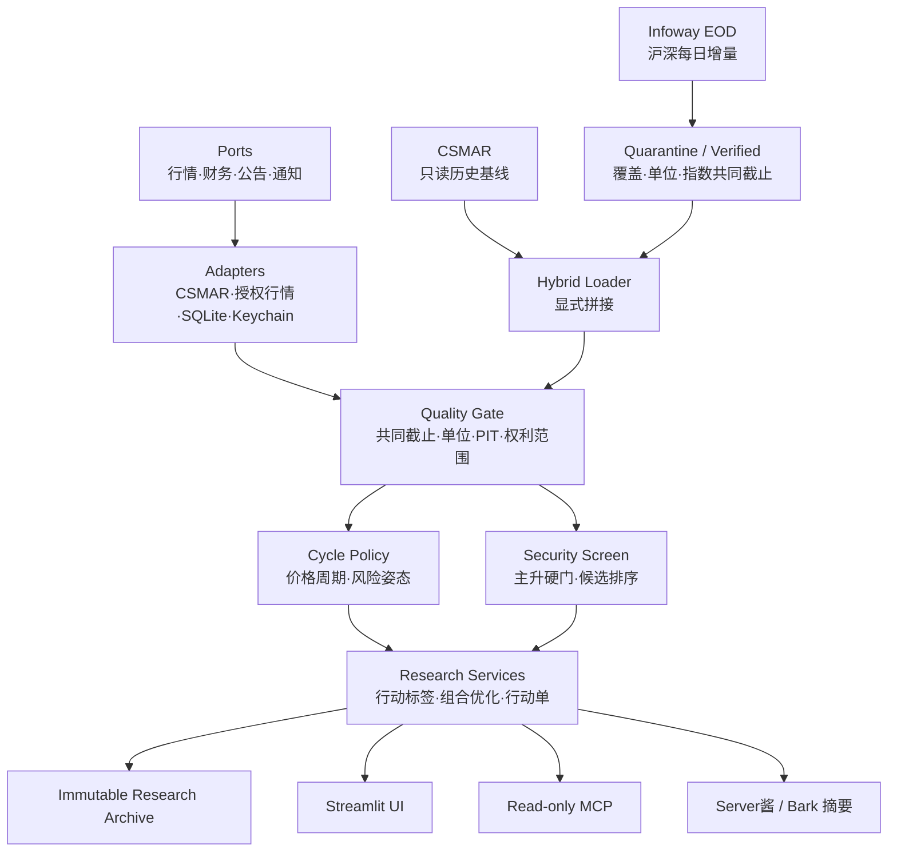

# 架构

A Share Lab 是本地优先的确定性研究程序。UI、MCP 和通知都只是入口；它们不能绕过数据
质量、策略和风险服务。

## 分层规则

- `domain/`：不可变模型、状态和市场规则；
- `ports/`：供应商无关的输入/输出契约；
- `adapters/`：读取本地库或经授权 API，标准化后立即校验；
- `analytics/`：纯函数指标、趋势、介入点、价格周期政策和组合风险；
- `services/`：编排数据门、研究漏斗、归档和通知；
- `ui/`：只展示服务返回的结构化结果；
- `mcp_server.py`：只读最小工具，不返回原始授权数据；
- `migrations/`：研究运行、证据、组合和真实结果的不可变档案。

语言模型不得计算价格、指标、权重、收益或概率。它可以在结构化结果形成后解释证据、
提出反例，并对最终少量候选做公开信息复核。

## 失败策略

系统 fail closed：来源失败、截止日不一致、字段漂移、单位不明或证据时点不安全时返回
`DATA_NOT_READY`，不静默换源。个股硬门、周期介入门或组合风险预算失败时也不放宽门槛
凑股票，但不会把已经形成的研究候选删除：页面仍可展示 3–5 只候选，而可介入数与实际
持仓数允许为 0。

## 双层决策边界

- `analytics/cycle_policy.py` 只把全市场和核心指数的同日价格证据翻译成周期标签、介入
  严格度、下行风险预算和股票敞口上限；它不读取新闻、不评估企业、不改变个股排名；
- `services/build_midterm_portfolio.py` 独立完成个股主升/介入结构筛选和机器排序，通常展示
  4 只研究候选，在安全门通过的标的不足时可少于 3 只且不组成组合；
- 服务层先对研究候选搜索 3/4/5 股风险可行组合并给出研究权重；这些权重不是当前持仓；
- 服务层再把候选标记为 `CONDITIONAL_ENTRY`、`WAIT_CONFIRMATION` 或 `OBSERVE_ONLY`。
  只有至少 3 只通过当前介入门，才另行搜索行动层 3/4/5 股风险可行组合；否则实际持仓
  为 0、现金为 100%；
- 防御周期只收紧风险姿态，不停止候选发现。缺少或错位的周期证据才是数据错误。

当前代码按单个共同截止日确定性输出五个可用状态：`UPTREND_EXPANSION`
（中期上行｜短线增强）、`UPTREND_PULLBACK`（中期上行｜短线回撤或分化）、
`TRANSITION_RECOVERY`（中期过渡｜复苏尝试或证据混合）、`DOWNTREND_REPAIR`
（中期下行｜短线修复反弹）和 `DOWNTREND_PRESSURE`（中期下行｜短线压力）；
`UNAVAILABLE` 表示价格周期数据不可用。当前没有跨日状态持久化或迟滞，也不是完整的
霍华德·马克斯经济、信贷、估值与心理周期模型。

## 每日收盘增量

- `csmar.duckdb` 永久作为只读历史基线；自动更新不会向它写入任何记录；
- Infoway 日线按供应商、未复权口径和交易日写入独立 `market_overlay`；
- 每个交易日先进入 staging。沪深股票覆盖率不低于 98%、六个核心指数齐全、交易日连续、
  日期/单位/OHLC/前收均合法后，股票与指数才一起写入 verified manifest；
- 不完整批次进入 quarantine，不能推进共同截止日；后续交易日不能越过失败日；
- 股票成交量按已校准合同由“手”转换为“股”，成交额为人民币元，并逐行验证隐含成交价
  落在当日高低价内；指数使用成分证券合计量额，不与指数点位相除；
- Infoway 当前自动母集明确为沪深 A 股，不包含北交所，也排除其清单中混入的指数和 B 股；
- 混合读取只追加历史基线之后的 verified 交易日。重叠数据不覆盖 CSMAR，新代码若不在
  CSMAR 证券主表中则隔离，所有行继续保留来源与取得时间。

## 入口边界

- 本地网页：面向非技术用户的主入口；
- MCP：供 ChatGPT/Codex 在本机只读调用；
- 通知：只发行动摘要，任何通道失败都不改变研究结论；
- 本项目没有券商下单端口，不会自动交易。
