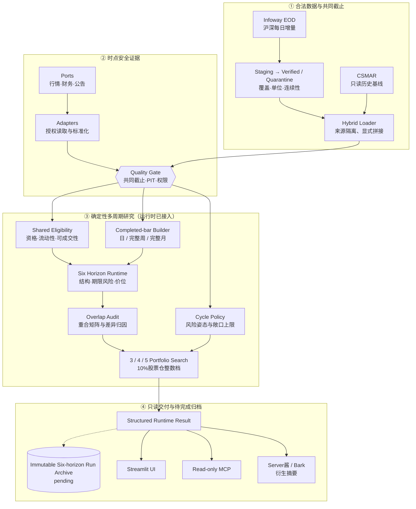

# 架构

A Share Lab 是本地优先的确定性研究程序。UI、MCP 和通知都只是入口；它们不能绕过数据
质量、策略和风险服务。

多周期 core 已经贯通组合 service、Streamlit UI、只读 MCP 和晚间 digest，并以 2026-08-27
共同截止日做过一次真实数据的只读链路验收；图中的实线表示这条运行路径。虚线归档仍是
`multi-timeframe-contract-v0.2.0` 的未完成部分：只有不可变运行档案实际包含点时官方日历确定的
完整周/月 bar 截止、六期限独立结构/风险/LCB/价位以及重合归因时，运行才可声明完整合同。
当前中央状态是 `integration_pending`，单次运行属于 `partial_multiframe`；架构图和组件版本都
不能代替运行时归档证据。

## 分层规则

- `domain/`：不可变模型、状态和市场规则；
- `ports/`：供应商无关的输入/输出契约；
- `adapters/`：读取本地库或经授权 API，标准化后立即校验；
- `analytics/`：纯函数指标、趋势、介入点、价格周期政策和组合风险；
- `services/`：编排数据门、研究漏斗、归档和通知；
- `ui/`：只展示服务返回的结构化结果；
- `mcp_server.py`：只读最小工具，不返回原始授权数据；
- `migrations/`：研究运行、证据、组合和真实结果的不可变档案。

语言模型不得计算价格、指标、权重、收益或概率。它可以在结构化结果形成后解释证据、
提出反例，并对最终少量候选做公开信息复核。

## 失败策略

系统 fail closed：来源失败、截止日不一致、字段漂移、单位不明或证据时点不安全时返回
`DATA_NOT_READY`，不静默换源。个股硬门、周期介入门或组合风险预算失败时也不放宽门槛
凑股票，但不会把已经形成的研究候选删除：页面仍可展示 3–5 只候选，而可介入数与实际
持仓数允许为 0。

## 双层决策边界

- `analytics/cycle_policy.py` 只把全市场和核心指数的同日价格证据翻译成周期标签、介入
  严格度、下行风险预算和股票敞口上限；它不读取新闻、不评估企业、不改变个股排名；
- `services/build_midterm_portfolio.py` 独立完成个股主升/介入结构筛选和机器排序，通常展示
  4 只研究候选，在安全门通过的标的不足时可少于 3 只且不组成组合；
- 服务层先对研究候选搜索 3/4/5 股风险可行组合并给出研究权重；这些权重不是当前持仓；
- 服务层再把候选标记为 `CONDITIONAL_ENTRY`、`WAIT_CONFIRMATION` 或 `OBSERVE_ONLY`。
  只有至少 3 只通过当前介入门，才另行搜索行动层 3/4/5 股风险可行组合；否则实际持仓
  为 0、现金为 100%；
- 防御周期只收紧风险姿态，不停止候选发现。缺少或错位的周期证据才是数据错误。

## 多周期运行时与目标边界

当前运行路径已经在质量门之后拆成“共享资格 + 六个期限计算”，而不是把同一份日线候选名单
复制六次；完整 `multi-timeframe-contract-v0.2.0` 仍要求把以下语义全部写入不可变逐运行档案：

1. **共享资格层**只负责证券身份、ST/停牌、上市历史、流动性、可成交性、公司行为和共同
   截止；它可以安全复用，但不得决定某一持有期的图形结构。
2. **Completed-bar Builder**从同一日线来源确定性构建日、周、月序列。周线和月线只输出在
   决策截止日前已完成的 bar；当前周/月累计行情只能进入日线执行证据。当前完成边界使用
   周五/工作月末保守回退，尚未接入历史时点的官方交易日历边界，因此仍是部分实现。
3. **期限引擎**分别保存采样周期、回看长度、计划持有期和复核/调仓周期，并分别计算慢周期
   方向、主结构门、下行风险预算、持有期收益 LCB、条件介入线和结构失效线。日线执行价不得
   绕过 3 个月以上期限的完整周/月结构门。
4. **重合审计**计算六期限集合的两两重合率和逐股差异归因。股票真实跨期共振是允许结果；
   系统不得为了视觉差异加入次优股票，也不得把重合当成六份独立证据。
5. **组合层**对每个期限独立运行 3/4/5 股风险搜索和 10% 股票仓整数档离散化；不能复用
   3 个月组合后只更换报告标题。

当前末端风险保护也有明确边界：共享日线 5/20/60/120 日加速规则会冻结所有期限的新介入，
各期限再保存自己的结构状态和日线执行 `EXTENDED` 状态；尚未加入未经点时校准的周线/月线
主周期过热阈值。因此这套保护不能被称作“六个期限各自已有独立成熟度门”。

每日 21:00 运行可以更新所有期限的执行状态，但不代表所有结构每天变化，也不等于每天调仓。
3 个月和 6 个月的主结构只能随新的完整周线更新；1 年的月线方向只能随新的完整月线更新，
其间日线只负责次日条件价、可买性和失效监控。

研究服务必须归档等价于以下语义的字段（具体序列化名称可以演进）：每个采样周期的最后完整
bar 截止、每个期限的结构门结果与原因、风险预算版本、forward-label/LCB 定义、价位来源周期、
结构/执行更新时间、两两重合矩阵和逐股差异归因。缺失这些证据时策略实现标签必须是
`partial_multiframe`，并按既有最终报告合同返回相应的研究/验证状态；不能悄悄回退后仍声称
完成多周期研究。

中央状态升级至少还需要四项：点时官方交易日历的周/月完成边界、上述六期限证据的不可变
逐运行归档、经校准的周/月主周期末端成熟度门，以及严格样本外 walk-forward。运行链路验收
只证明组件接通，不替代这四项。

当前代码按单个共同截止日确定性输出五个可用状态：`UPTREND_EXPANSION`
（中期上行｜短线增强）、`UPTREND_PULLBACK`（中期上行｜短线回撤或分化）、
`TRANSITION_RECOVERY`（中期过渡｜复苏尝试或证据混合）、`DOWNTREND_REPAIR`
（中期下行｜短线修复反弹）和 `DOWNTREND_PRESSURE`（中期下行｜短线压力）；
`UNAVAILABLE` 表示价格周期数据不可用。当前没有跨日状态持久化或迟滞，也不是完整的
霍华德·马克斯经济、信贷、估值与心理周期模型。

## 每日收盘增量

- `csmar.duckdb` 永久作为只读历史基线；自动更新不会向它写入任何记录；
- Infoway 日线按供应商、未复权口径和交易日写入独立 `market_overlay`；
- 每个交易日先进入 staging。沪深股票覆盖率不低于 98%、六个核心指数齐全、交易日连续、
  日期/单位/OHLC/前收均合法后，股票与指数才一起写入 verified manifest；
- 不完整批次进入 quarantine，不能推进共同截止日；后续交易日不能越过失败日；
- 股票成交量按已校准合同由“手”转换为“股”，成交额为人民币元，并逐行验证隐含成交价
  落在当日高低价内；指数使用成分证券合计量额，不与指数点位相除；
- Infoway 当前自动母集明确为沪深 A 股，不包含北交所，也排除其清单中混入的指数和 B 股；
- 混合读取只追加历史基线之后的 verified 交易日。重叠数据不覆盖 CSMAR，新代码若不在
  CSMAR 证券主表中则隔离，所有行继续保留来源与取得时间。

## 入口边界

- 本地网页：面向非技术用户的主入口；
- MCP：供 ChatGPT/Codex 在本机只读调用；
- 通知：只发行动摘要，任何通道失败都不改变研究结论；
- 本项目没有券商下单端口，不会自动交易。
