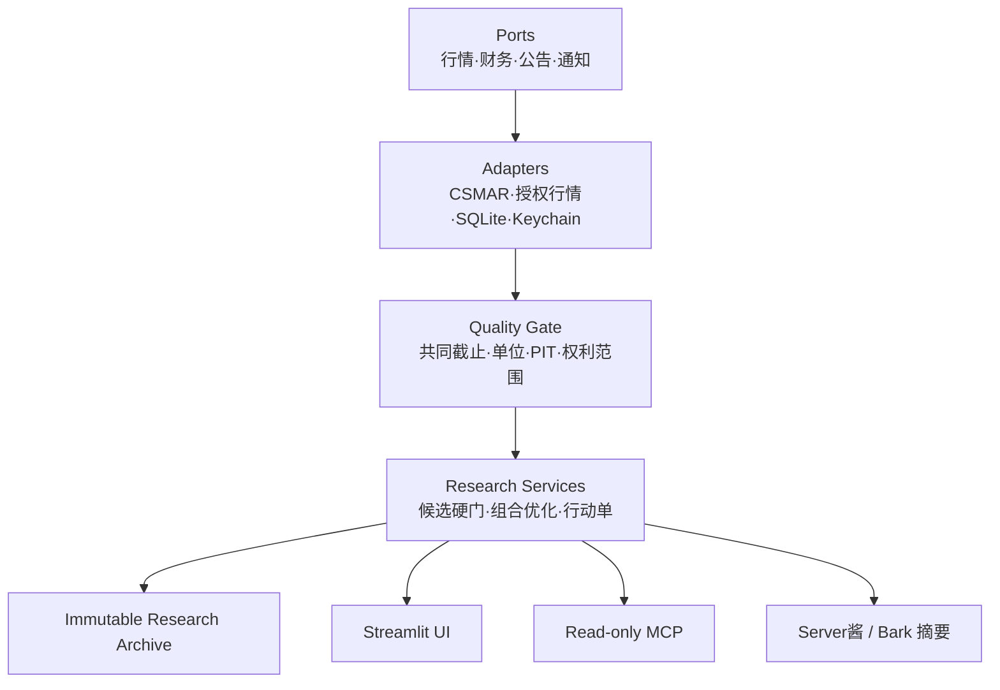

# 架构

A Share Lab 是本地优先的确定性研究程序。UI、MCP 和通知都只是入口；它们不能绕过数据
质量、策略和风险服务。

## 分层规则

- `domain/`：不可变模型、状态和市场规则；
- `ports/`：供应商无关的输入/输出契约；
- `adapters/`：读取本地库或经授权 API，标准化后立即校验；
- `analytics/`：纯函数指标、趋势、介入点和组合风险；
- `services/`：编排数据门、研究漏斗、归档和通知；
- `ui/`：只展示服务返回的结构化结果；
- `mcp_server.py`：只读最小工具，不返回原始授权数据；
- `migrations/`：研究运行、证据、组合和真实结果的不可变档案。

语言模型不得计算价格、指标、权重、收益或概率。它可以在结构化结果形成后解释证据、
提出反例，并对最终少量候选做公开信息复核。

## 失败策略

系统 fail closed：来源失败、截止日不一致、字段漂移、单位不明、证据时点不安全或风险
预算失败时返回明确状态，不静默换源，也不放宽门槛凑股票。

## 入口边界

- 本地网页：面向非技术用户的主入口；
- MCP：供 ChatGPT/Codex 在本机只读调用；
- 通知：只发行动摘要，任何通道失败都不改变研究结论；
- 本项目没有券商下单端口。
