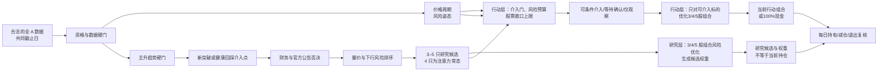

# 中期选股与组合方法

本文是 A Share Lab 的策略契约。它描述程序应该如何工作，也明确哪些结论在完成严格
样本外验证之前只能称为“研究结果”。主研究周期是 **1 周至 3 个月**，默认 3 个月；
6 个月至 1 年只作为趋势延续和长期复核窗口。

## 一句话方法

> 价格与成交额决定候选资格和介入结构；财务与官方公告负责否决明显风险；价格周期
> 调整介入严格度、风险预算和股票敞口；组合优化在预算内选择 3–5 只股票和自动权重。

这不是纯 K 线派，也不是把新闻、情绪、财务和几十种指标混成一个不可解释的总分。
价格已经包含大量公开信息，因此承担主排序；基本面和公告仍有价值，但主要用于发现
价格尚未充分反映、却可能造成永久损失的风险。

## 研究漏斗



数据合格且至少三只股票通过个股硬门时，程序继续展示 3–5 只研究候选；周期偏弱不能把
候选清零。候选不等于当前可以买，周期介入门或组合风险预算可以让可介入数量和实际持仓
数量为 0。若个股硬门本身只剩 0–2 只，则如实展示已有证据且不组成组合，程序不得为了
凑数而降低硬门。

研究层与行动层各自运行组合风险计算：研究层回答“如果只比较这些候选，怎样分散更合理”；
行动层回答“今天究竟能否形成持仓”。因此研究候选可以有排序和假设权重，而行动层仍保持
0% 股票、100% 现金。页面必须同时显示两者，不能把研究权重冒充真实持仓。

若没有组合通过全部风险与持有期收益下界，可以从已完成数据、行业和10%结构评估的四股集合中，
选出违反门数更少、标准化超限更小、收益下界更高的一组作为“候选观察方案”。它只显示观察池内
10% 整数档配比与价格观察线，不换算成总资金仓位，不称最优、可买或可执行，行动层仍为现金。

## 1. 全市场与数据硬门

形成日的所有输入必须满足：

- 使用同一个实际完整收盘日，并满足可配置的全市场证券数量与覆盖率下限；只有几只或
  几十只股票的数据不能冒充“全市场研究”；
- 股票主表、交易状态、价格、成交额和行业字段可审计；
- ST、退市整理、停牌、明确不可买、形成日封死涨停、上市历史不足、流动性不足均排除；
- 原始未复权价格出现无法解释的公司行为跳变时排除，而不是擅自修复；
- 任何财务或公告只能在真实可知时间之后使用；缺失值保持缺失。

全市场覆盖、新鲜度或单位检查不通过时，状态是 `DATA_NOT_READY`。

## 2. 价格周期与风险姿态

全市场宽度与核心指数必须使用同一截止日。价格周期与个股筛选是两个独立层：无论周期
偏强或偏弱，个股主升筛选和候选排序都会继续；周期不给单只股票增加分数，只调整介入
确认、下行风险预算和最大股票敞口。候选的行动状态是：

- `CONDITIONAL_ENTRY`：已经通过当前周期对应的确认门，仍不是自动买单；
- `WAIT_CONFIRMATION`：候选有效，但介入结构或财务、公告、可买性证据仍待确认；
- `OBSERVE_ONLY`：在“中期下行｜短线压力”下没有通过例外级介入门，只观察。

因此 3–5 只研究候选可以同时存在，而当前可介入数量为 0、实际持仓为 0、现金为 100%。
只有周期所需数据过期、缺失、非有限或与个股截面错位时，才返回 `DATA_NOT_READY`。

当前 `cycle_policy.py` 是按单个共同截止日运行的确定性价格代理，使用全市场 MA20 宽度与
20 日收益中位数，以及核心指数 MA20/MA60/MA120 宽度、20/60 日收益、60 日年化波动和
120 日回撤。五个可用状态与一个不可用状态如下：

| 代码状态 | 页面标签 | 股票敞口上限 | 介入严格度 |
|---|---|---:|---|
| `UPTREND_EXPANSION` | 中期上行｜短线增强 | 80% | `STANDARD` |
| `UPTREND_PULLBACK` | 中期上行｜短线回撤或分化 | 60% | `TIGHT` |
| `TRANSITION_RECOVERY` | 中期过渡｜复苏尝试或证据混合 | 50% | `TIGHT` |
| `DOWNTREND_REPAIR` | 中期下行｜短线修复反弹 | 30% | `DEFENSIVE` |
| `DOWNTREND_PRESSURE` | 中期下行｜短线压力 | 20% | `EXCEPTION_ONLY` |
| `UNAVAILABLE` | 价格周期数据不可用 | 0% | `UNAVAILABLE` |

页面的 `confidence` 是支持该标签的规则一致度，不是未来方向概率。当前版本没有跨日状态
持久化或迟滞，也没有实现霍华德·马克斯所讨论的完整经济、盈利、信贷、估值和心理周期；
它只借用“在过度与修正中调整进攻/防守”的思想，不能预言牛熊起点、终点或幅度。

## 3. Edwards–Magee：把图形变成硬规则

《股市趋势技术分析》在本项目中是结构语言，而不是由模型主观识图。候选必须同时满足：

1. MA20、MA60、MA120 与中期收益结构显示早期或有序上升趋势；
2. 下降、普通震荡、明显延伸和抛物线加速全部排除；
3. 出现以下介入结构之一：
   - 最近 10 个交易日内，收盘突破此前 60 日高点，并由成交额确认；
   - 过去 30 个交易日内已经放量突破，随后缩量回踩突破线并重新站稳；
4. 当前价格距离 MA20 不超过 12%，且不超过 3 个 ATR，避免在主升浪末端追价。

突破线只使用当前 K 线以前的数据，转折点必须等待右侧确认，因此不会把未来数据偷带
进形成日。

## 4. Livermore：负责行动纪律

利弗莫尔思想不作为一个模糊加分项，而转译为执行规则：

- 等待关键点被收盘确认；
- 首次建仓从风险可控的确认点开始；
- 只向已经盈利、趋势继续确认的仓位加码；
- 不向亏损仓摊低成本；
- 结构失效时退出，不因为“长期看好”取消风险线。

书中的固定美元点数不适合 A 股，程序使用 ATR 和结构高低点进行波动缩放。

## 5. 基本面、公告和新闻

基本面与官方公告位于量价筛选之后，采用 `PASS / VETO / UNKNOWN`：

- `VETO`：重大财务恶化、审计异常、监管立案、退市风险、重大减持等，排除；
- `UNKNOWN`：关键证据缺失，不能伪装成通过；程序只可返回
  `VALIDATION_NOT_READY` 临时候选，补齐证据前不能成为最终买入清单；
- `PASS`：只表示未发现否决风险，不给股票额外“利好分”。

新闻和社交讨论不进入主排序。它们只用于最终候选的事件核验和解释；事实优先采用交易所、
巨潮和公司正式公告。网页公开可见不等于允许批量缓存或再分发。

## 6. 候选排序与持有期口径

所有通过硬门的股票都进入机器计算，不要求人工先挑 20 只。排序只使用确定性、可回放的
证据：

- 突破新鲜度、回踩质量、成交额确认和趋势连续性；
- 20/60/120 日相对强度（权重随研究周期变化）；
- 下行波动、滚动回撤和尾部损失；
- 正常成交容量。

为了控制组合搜索量，程序可从全合格池中保留机器排名靠前的计算池；这是明确记录的计算
近似，不是人工挑选，也不能宣称穷举了全市场全部组合。

所有入口统一使用下列交易日口径，不能再用“周数 × 5”把 13 周误算成 65 个交易日：

| 研究选项 | 统计与风险窗口 |
|---|---:|
| 1 周 | 5 个交易日 |
| 2 周 | 10 个交易日 |
| 1 个月 | 20 个交易日 |
| 3 个月（默认） | 60 个交易日 |
| 6 个月 | 120 个交易日 |
| 1 年 | 252 个交易日 |

周期会改变动量合成、历史收益下界和样本要求，但仍属于同一透明模型的参数化版本；各周期
尚未完成独立 point-in-time walk-forward 验证。

## 7. 为什么是 3–5 只

- **4 只为常态**：只要存在通过全部硬风险预算的四股组合，就以其中历史收益下界最高者
  作为基准；
- **3 只**：没有任何四股组合通过风险预算、但三股组合可行时采用，股票敞口降至 70%，
  现金提高到 30%；
- **5 只**：五股组合只有在收益下界高于四股基准、下行波动/滚动回撤/ES 不显著恶化，
  且下跌相关性至少改善 0.05 或最大单股风险贡献至少改善 0.03 时才替代四股组合；如果
  四股全部不可行而五股因分散通过预算，也可采用五股；
- 不超过 5 只，也不为维持 4 只而买入次优股票。

程序分别搜索 3、4、5 只的可行组合，再在同一风险和成本口径下比较。70%/80%/85% 是
周期调整前的档位上限；最终股票敞口还要取该档位与上表周期上限的较低者，其余为现金。

## 8. 风险预算与目标函数

Sharpe 不是纯风险指标，也不足以描述 A 股的跳空、连续下跌和回撤路径。最小风险集合是：

1. 年化下行波动率；
2. 60 日滚动最大回撤严重度的第 90 百分位；
3. 复合 5 日收益的 95% Expected Shortfall（最差 5% 的平均损失）；
4. 下跌期最大相关性；
5. 最大单股下行风险贡献。

行业权重、单股权重、流动性和 A 股可成交规则也是硬约束。只有满足全部预算的组合才进入
比较。目标是在给定持有期内最大化**扣费后收益下置信界**；在严格 walk-forward 和成本
模型完成前，程序只能展示历史保守代理，不得把它叫预测或承诺。

Sharpe 仅作辅助报告，Sortino 下界用于同风险结果的次级排序。

## 9. 自动权重

每只股票的初始权重由“信号确信度 ÷ 下行波动”得到：

```text
raw_weight_i = bounded_signal_tilt_i / downside_volatility_i
```

随后投影到以下约束：

- 权重为正、总股票敞口与 3/4/5 股档位一致；
- 单股有上下限，防止一只低波动股票吞掉组合；
- 单一行业不超过周期政策给出的账户净资产上限：上行增强 40%、上行回撤 30%、过渡修复
  25%、下行修复 15%、下行压力 10%；
- 最大单股下行风险贡献不超过预算；
- 融资始终为 0。

全精度连续权重按数值从大到小排序并保留作审计目标与离散化依据。固定 `3:2:2:1` 仅保留
为旧版兼容方案，不再是新主模型的默认答案。

字段口径必须明确：研究层的 `research_weight` 与行动层的 `position.weight` 都是相对
**总资金**的精确连续审计目标，也是离散化依据；它们不用于最终风险或收益指标，不是面向
实际操作的整数档。精确股票仓内占比分别按下式计算：

```text
research_sleeve_weight_i = research_weight_i / research_stock_exposure
action_sleeve_weight_i = position.weight_i / stock_exposure
```

分母为 0 时不计算股票仓内占比。面向用户的操作版采用**股票仓内 10% 整数档**，所有股票
仓内操作比例严格合计 100%，并满足：

| 持股数 | 单股股票仓内操作比例 |
|---:|---:|
| 3 股 | 20%–50% |
| 4 股 | 10%–40% |
| 5 股 | 10%–30% |

操作层新增两个明确字段：`operational_stock_sleeve_weight` 保存股票仓内 10% 档，
`operational_account_weight` 保存其对应的总资金权重。总资金权重本身不一定是 10% 整数档，
而按本轮周期约束后的股票敞口换算：

```text
research_operational_account_weight_i = research_stock_exposure * operational_stock_sleeve_weight_i
action_operational_account_weight_i = stock_exposure * operational_stock_sleeve_weight_i
cash_weight = 1 - stock_exposure
```

对每个股票组合，程序先穷举满足单股边界和行业结构约束的全部 10% 档，再以股票仓内
**平方误差之和最小**选择离连续目标最近的唯一档位；误差完全相同时按原始研究顺序作
确定性裁决。只有这个最近档会使用 `operational_account_weight` 重新计算下行波动、滚动
回撤、5 日 ES、单股下行风险贡献、行业权重、持有期收益下界和其他最终指标。

如果最近档没有通过风险预算，该股票组合立即淘汰；程序不再搜索第二近或更远的档位来
“救活”它。这条规则防止离散权重为了通过风险门而过度偏离连续审计目标。若最终没有股票
组合通过，则不形成组合并保留现金，不能把精确连续目标冒充可操作方案，也不能降低约束
凑数。上述候选观察配比只是对已被拒组合的诊断性展示，不改变该结论。

精确连续权重与操作版权重都是当前候选池、风险预算、约束和确定性搜索近似下的自动研究
结果，不是券商账户实仓或下单指令，不是穷举全市场全部组合得到的全局数学最优，也不
代表未来最优配置。

## 10. 验证与诚实边界

正式声称“单位风险收益更高”之前，必须完成：

- 每个历史形成日重新走全市场筛选，不能用今天的四只股票回填历史；
- point-in-time 证券状态、财务披露、公司行为和行业归属；
- purged walk-forward 与 embargo；
- 佣金、印花税、滑点、冲击成本、涨跌停、停牌和 T+1；
- block bootstrap 收益/Sharpe/Sortino 下置信界；
- 覆盖上涨、下跌、震荡市场并保留退市股。

验证未完成时状态是 `VALIDATION_NOT_READY` 或 `RESEARCH_ONLY`。排名、历史频率和历史
收益区间都不是未来概率。

## 11. 每日管理

组合形成后，不需要每天重算全市场并高换手。正常流程是：

- 收盘数据完整后生成一次行动单：`持有 / 观察减仓 / 退出 / 数据不足`；
- 次日开盘前只复核隔夜公告、停牌和异常跳空；
- 某只退出后先保留现金；组合出现空位时，用同一完整数据截面重新运行候选与组合约束，
  并应用当日周期风险姿态；若没有标的通过介入门或风险预算，就继续保留现金；
- 不必等待四只全部退出，也不因单只退出就把全部健康仓位换掉。

通知只传递衍生行动摘要，不自动下单。

当前自动通知采用“15:30 首次收盘同步、18:30 数据复核、21:00 次日研究报告”的顺序。
六周期报告与去重、安全边界见 [21:00 次日研究报告](EVENING_REPORT.md)。
