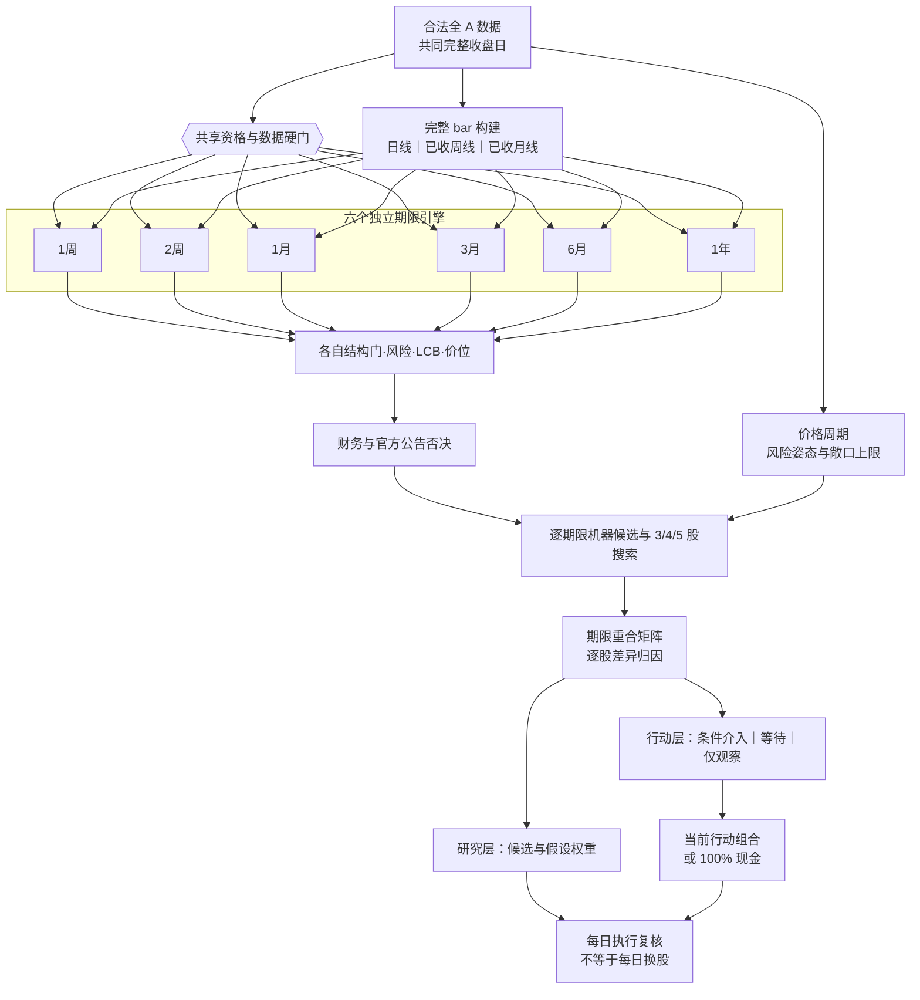

# 中期选股与组合方法

本文是 A Share Lab 的策略契约。它描述程序应该如何工作，也明确哪些结论在完成严格
样本外验证之前只能称为“研究结果”。主研究周期是 **1 周至 3 个月**，默认 3 个月；
6 个月至 1 年只作为趋势延续和长期复核窗口。

## 模型版本与实现声明

**中央实现状态：`integration_pending`。**

下文的多周期嵌套规则是 `multi-timeframe-contract-v0.2.0` 的**目标合同**。文档写入规则不等于程序
已经实现规则；某次研究只有在归档中同时保存完整周/月线截止、逐期限结构门、逐期限风险与
收益下界、逐期限价位来源以及期限重合归因时，才可以声明使用该版本。缺少任一项的运行必须
标为 `legacy_single_daily_gate` 或 `partial_multiframe`，不能把六次参数化的同一日线筛选描述成
六个独立周期模型。最终以每次研究归档中的策略版本和审计字段为准，而不是以 README、页面
文案或仓库当前分支为准。

运行时的多周期 core 已接入组合 service、UI、只读 MCP 和晚间 digest，并以 2026-08-27 为
共同截止日完成过一次真实数据的只读链路验收。它证明六期限路由与输出链已接通，不会把
组件接入自动升级为中央合同完成：当前仍缺点时官方交易日历完成周/月边界、六期限证据的
不可变逐运行归档、经校准的周/月主周期末端成熟度门，以及严格样本外 walk-forward。因此
当前运行应标为 `partial_multiframe`，中央状态保持 `integration_pending`。

## 一句话方法

> 价格与成交额决定候选资格和介入结构；财务与官方公告负责否决明显风险；价格周期
> 调整介入严格度、风险预算和股票敞口；组合优化在预算内选择 3–5 只股票和自动权重。

这不是纯 K 线派，也不是把新闻、情绪、财务和几十种指标混成一个不可解释的总分。
价格已经包含大量公开信息，因此承担主排序；基本面和公告仍有价值，但主要用于发现
价格尚未充分反映、却可能造成永久损失的风险。

## 研究漏斗（多周期目标）



数据合格且至少三只股票通过个股硬门时，程序继续展示 3–5 只研究候选；周期偏弱不能把
候选清零。候选不等于当前可以买，周期介入门或组合风险预算可以让可介入数量和实际持仓
数量为 0。若个股硬门本身只剩 0–2 只，则如实展示已有证据且不组成组合，程序不得为了
凑数而降低硬门。

研究层与行动层各自运行组合风险计算：研究层回答“如果只比较这些候选，怎样分散更合理”；
行动层回答“今天究竟能否形成持仓”。因此研究候选可以有排序和假设权重，而行动层仍保持
0% 股票、100% 现金。页面必须同时显示两者，不能把研究权重冒充真实持仓。

若没有组合通过全部风险与持有期收益下界，可以从已完成数据、行业和10%结构评估的四股集合中，
选出违反门数更少、标准化超限更小、收益下界更高的一组作为“候选观察方案”。它只显示观察池内
10% 整数档配比与价格观察线，不换算成总资金仓位，不称最优、可买或可执行，行动层仍为现金。

## 1. 全市场与数据硬门

形成日的所有输入必须满足：

- 使用同一个实际完整收盘日，并满足可配置的全市场证券数量与覆盖率下限；只有几只或
  几十只股票的数据不能冒充“全市场研究”；
- 股票主表、交易状态、价格、成交额和行业字段可审计；
- ST、退市整理、停牌、明确不可买、形成日封死涨停、上市历史不足、流动性不足均排除；
- 原始未复权价格出现无法解释的公司行为跳变时排除，而不是擅自修复；
- 任何财务或公告只能在真实可知时间之后使用；缺失值保持缺失。

全市场覆盖、新鲜度或单位检查不通过时，状态是 `DATA_NOT_READY`。

## 2. 价格周期与风险姿态

全市场宽度与核心指数必须使用同一截止日。价格周期与个股筛选是两个独立层：无论周期
偏强或偏弱，个股主升筛选和候选排序都会继续；周期不给单只股票增加分数，只调整介入
确认、下行风险预算和最大股票敞口。候选的行动状态是：

- `CONDITIONAL_ENTRY`：已经通过当前周期对应的确认门，仍不是自动买单；
- `WAIT_CONFIRMATION`：候选有效，但介入结构或财务、公告、可买性证据仍待确认；
- `OBSERVE_ONLY`：在“中期下行｜短线压力”下没有通过例外级介入门，只观察。

因此 3–5 只研究候选可以同时存在，而当前可介入数量为 0、实际持仓为 0、现金为 100%。
只有周期所需数据过期、缺失、非有限或与个股截面错位时，才返回 `DATA_NOT_READY`。

当前 `cycle_policy.py` 是按单个共同截止日运行的确定性价格代理，使用全市场 MA20 宽度与
20 日收益中位数，以及核心指数 MA20/MA60/MA120 宽度、20/60 日收益、60 日年化波动和
120 日回撤。五个可用状态与一个不可用状态如下：

| 代码状态 | 页面标签 | 股票敞口上限 | 介入严格度 |
|---|---|---:|---|
| `UPTREND_EXPANSION` | 中期上行｜短线增强 | 80% | `STANDARD` |
| `UPTREND_PULLBACK` | 中期上行｜短线回撤或分化 | 60% | `TIGHT` |
| `TRANSITION_RECOVERY` | 中期过渡｜复苏尝试或证据混合 | 50% | `TIGHT` |
| `DOWNTREND_REPAIR` | 中期下行｜短线修复反弹 | 30% | `DEFENSIVE` |
| `DOWNTREND_PRESSURE` | 中期下行｜短线压力 | 20% | `EXCEPTION_ONLY` |
| `UNAVAILABLE` | 价格周期数据不可用 | 0% | `UNAVAILABLE` |

页面的 `confidence` 是支持该标签的规则一致度，不是未来方向概率。当前版本没有跨日状态
持久化或迟滞，也没有实现霍华德·马克斯所讨论的完整经济、盈利、信贷、估值和心理周期；
它只借用“在过度与修正中调整进攻/防守”的思想，不能预言牛熊起点、终点或幅度。

## 3. Edwards–Magee 与多周期嵌套

《股市趋势技术分析》在本项目中是结构语言，而不是由模型主观识图。`multi-timeframe-contract-v0.2.0`
不采用“短期看日线、长期只看月线”的互斥切换，而采用：

> 慢周期决定允许的方向，主周期识别底座、突破或回踩，执行周期把结构翻译成次日可验证的
> 条件价位和失效线。

日线执行不等于日线选股。3 个月以上的股票必须先通过完整周线或月线的主结构门，之后才可用
日线确认可买性；一根日线突破不能替代长期结构。所有期限先经过同一套证券资格、数据质量、
可成交性、流动性、ST/停牌和公司行为硬门，之后必须分别计算自己的结构门、风险预算、持有期
收益下置信界（LCB）、介入线与失效线。

### 四种时间概念必须分开

- **信号采样周期**：日、周、月 K 线如何聚合；
- **信号回看长度**：在该采样周期上使用多少根已经完成的 K 线；
- **计划持有期**：用于结果标签和收益 LCB 的未来交易日长度；
- **复核/调仓周期**：何时允许重建组合。每日生成行动复核不代表每天换股。

不能用“持有 60 日”反推“必须看 60 根日线”，也不能把 252 日回看、1 年持有和每月调仓
当成同一个参数。四者必须单独配置并写入归档。

### 六个期限的目标合同

| 研究期限 | 慢周期背景 | 主结构周期 | 执行周期 | 主结构 / 慢周期刷新 |
|---|---|---|---|---|
| 1 周 / 5 日 | 已完成周线 | 日线新突破或首次健康回踩 | 日线 | 每日 / 每周 |
| 2 周 / 10 日 | 已完成周线 | 日线中短底座与有序趋势，排除五日脉冲 | 日线 | 每日 / 每周 |
| 1 个月 / 20 日 | 已完成周线 | 日线底座、放量突破与突破后承接 | 日线 | 每日 / 每周 |
| 3 个月 / 60 日 | 已完成月线 | 已完成周线趋势、平台与突破 | 日线确认 | 每周 / 每月 |
| 6 个月 / 120 日 | 已完成月线 | 已完成周线主趋势与二次突破/回踩 | 周线确认、日线执行 | 每周 / 每月 |
| 1 年 / 252 日 | 已完成月线主要趋势 | 已完成周线底座与长期突破 | 周线确认、日线执行 | 每周 / 每月 |

周线和月线一律只使用在决策截止日之前**已经收完**的 bar。周中不得把本周累计行情当成完整
周线确认，月中不得把本月累计行情当成完整月线突破。未完成 bar 可以作为独立的日线执行证据，
但必须带 `incomplete` 身份，且不能通过周/月结构硬门。节假日缩短的交易周仍可在该周最后一个
实际交易日收盘后形成完整周线。

若官方交易日历暂时不可用，可以保守地延后周/月 bar 完成时间，但绝不能提前闭合；该次运行
必须归档降级原因并标为部分实现，不能宣称完全符合多周期合同。

日线、周线和月线的突破线都只能引用当前已完成 bar 之前的数据，转折点必须等待右侧确认。
目标合同要求每个期限独立排除下降、普通震荡、明显延伸和抛物线加速，并以适合该采样周期的
ATR、均线距离、量价确认和结构高低点生成介入与失效条件。禁止把同一条 60 日高点线复制到
六个期限。

当前运行时已经独立计算各期限的慢周期、主结构和日线执行状态，但**尚未**实现经点时校准的
周线/月线末端成熟度硬门。现行保护由两部分组成：一是所有期限共享的日线 5/20/60/120 日
末端加速冻结，二是各期限结构状态与日线执行 `EXTENDED` 状态。它们能阻止明显的日线垂直
追高，却不能被描述成“每个期限已经拥有独立的周/月过热门”。在完成样本外校准前，程序不会
凭经验添加新的主周期过热阈值。

同一股票同时通过多个期限是合法的“真共振”，不需要为了让列表看起来不同而换入次优股票。
但报告必须给出期限间股票重合率/重合矩阵，并逐只说明重合来自共同资格门、慢周期方向、独立
突破确认还是仅仅排名接近；同时说明它为何进入本期限、为何未进入相邻期限。没有逐期限独立门
和差异归因时，不得使用“多周期共振”一词。

候选重合率采用 Jaccard 口径 `|A∩B| / |A∪B|`，候选池与风险合格组合分别报告；两边都为空
时显示“不可计算”，不能写成 100%。逐股差异至少区分：只共享资格、独立结构共振、慢周期
失败、主结构失败、风险/LCB 失败、价位尚未触发和仅排名接近。这样“股票相同”与“证据相同”
不会被混为一谈。

## 4. Livermore：负责行动纪律

利弗莫尔思想不作为一个模糊加分项，而转译为执行规则：

- 等待关键点被收盘确认；
- 首次建仓从风险可控的确认点开始；
- 只向已经盈利、趋势继续确认的仓位加码；
- 不向亏损仓摊低成本；
- 结构失效时退出，不因为“长期看好”取消风险线。

书中的固定美元点数不适合 A 股，程序使用 ATR 和结构高低点进行波动缩放。

## 5. 基本面、公告和新闻

基本面与官方公告位于量价筛选之后，采用 `PASS / VETO / UNKNOWN`：

- `VETO`：重大财务恶化、审计异常、监管立案、退市风险、重大减持等，排除；
- `UNKNOWN`：关键证据缺失，不能伪装成通过；程序只可返回
  `VALIDATION_NOT_READY` 临时候选，补齐证据前不能成为最终买入清单；
- `PASS`：只表示未发现否决风险，不给股票额外“利好分”。

新闻和社交讨论不进入主排序。它们只用于最终候选的事件核验和解释；事实优先采用交易所、
巨潮和公司正式公告。网页公开可见不等于允许批量缓存或再分发。

## 6. 候选排序与持有期口径

所有通过硬门的股票都进入机器计算，不要求人工先挑 20 只。排序只使用确定性、可回放的
证据：

- 突破新鲜度、回踩质量、成交额确认和趋势连续性；
- 主结构采样周期上的相对强度与慢周期方向；旧版仅使用 20/60/120 日相对强度，
  `multi-timeframe-contract-v0.2.0` 不得把这组三个日线窗口复制到长期期限；
- 下行波动、滚动回撤和尾部损失；
- 正常成交容量。

为了控制组合搜索量，程序可从全合格池中保留机器排名靠前的计算池；这是明确记录的计算
近似，不是人工挑选，也不能宣称穷举了全市场全部组合。

所有入口统一使用下列交易日口径，不能再用“周数 × 5”把 13 周误算成 65 个交易日：

| 研究选项 | 统计与风险窗口 |
|---|---:|
| 1 周 | 5 个交易日 |
| 2 周 | 10 个交易日 |
| 1 个月 | 20 个交易日 |
| 3 个月（默认） | 60 个交易日 |
| 6 个月 | 120 个交易日 |
| 1 年 | 252 个交易日 |

在旧版单日线参数化模型中，周期只改变动量合成、历史收益下界和样本要求，因此不同期限可能
机械地产生高度重合的结果。`multi-timeframe-contract-v0.2.0` 要求各期限在共享资格门之后独立运行主结构、
风险、LCB 和价位合同；它们可以返回相同股票，但必须由各自证据独立得到，而不是复用一份排名。
各期限仍尚未完成独立 point-in-time walk-forward 验证。

## 7. 为什么是 3–5 只

- **4 只为常态**：只要存在通过全部硬风险预算的四股组合，就以其中历史收益下界最高者
  作为基准；
- **3 只**：没有任何四股组合通过风险预算、但三股组合可行时采用，股票敞口降至 70%，
  现金提高到 30%；
- **5 只**：五股组合只有在收益下界高于四股基准、下行波动/滚动回撤/ES 不显著恶化，
  且下跌相关性至少改善 0.05 或最大单股风险贡献至少改善 0.03 时才替代四股组合；如果
  四股全部不可行而五股因分散通过预算，也可采用五股；
- 不超过 5 只，也不为维持 4 只而买入次优股票。

程序分别搜索 3、4、5 只的可行组合，再在同一风险和成本口径下比较。70%/80%/85% 是
周期调整前的档位上限；最终股票敞口还要取该档位与上表周期上限的较低者，其余为现金。

## 8. 风险预算与目标函数

Sharpe 不是纯风险指标，也不足以描述 A 股的跳空、连续下跌和回撤路径。旧版以固定日线
窗口形成一套风险集合；`multi-timeframe-contract-v0.2.0` 必须让每个期限独立形成风险预算，至少包括：

1. 日线执行风险与主结构采样周期上的年化下行波动率；
2. 与该持有期和结构周期对应的滚动最大回撤严重度，不能全部固定为 60 日；
3. 复合 5 日收益的 95% Expected Shortfall（共同的近期可执行尾部风险）以及该持有期的
   净收益尾部风险/LCB；
4. 下跌期最大相关性；
5. 最大单股下行风险贡献。

行业权重、单股权重、流动性和 A 股可成交规则也是硬约束。只有满足全部预算的组合才进入
比较。目标是在给定持有期内最大化**扣费后收益下置信界**；在严格 walk-forward 和成本
模型完成前，程序只能展示历史保守代理，不得把它叫预测或承诺。

Sharpe 仅作辅助报告，Sortino 下界用于同风险结果的次级排序。

## 9. 自动权重

每只股票的初始权重由“信号确信度 ÷ 下行波动”得到：

```text
raw_weight_i = bounded_signal_tilt_i / downside_volatility_i
```

随后投影到以下约束：

- 权重为正、总股票敞口与 3/4/5 股档位一致；
- 单股有上下限，防止一只低波动股票吞掉组合；
- 单一行业不超过周期政策给出的账户净资产上限：上行增强 40%、上行回撤 30%、过渡修复
  25%、下行修复 15%、下行压力 10%；
- 最大单股下行风险贡献不超过预算；
- 融资始终为 0。

全精度连续权重按数值从大到小排序并保留作审计目标与离散化依据。固定 `3:2:2:1` 仅保留
为旧版兼容方案，不再是新主模型的默认答案。

字段口径必须明确：研究层的 `research_weight` 与行动层的 `position.weight` 都是相对
**总资金**的精确连续审计目标，也是离散化依据；它们不用于最终风险或收益指标，不是面向
实际操作的整数档。精确股票仓内占比分别按下式计算：

```text
research_sleeve_weight_i = research_weight_i / research_stock_exposure
action_sleeve_weight_i = position.weight_i / stock_exposure
```

分母为 0 时不计算股票仓内占比。面向用户的操作版采用**股票仓内 10% 整数档**，所有股票
仓内操作比例严格合计 100%，并满足：

| 持股数 | 单股股票仓内操作比例 |
|---:|---:|
| 3 股 | 20%–50% |
| 4 股 | 10%–40% |
| 5 股 | 10%–30% |

操作层新增两个明确字段：`operational_stock_sleeve_weight` 保存股票仓内 10% 档，
`operational_account_weight` 保存其对应的总资金权重。总资金权重本身不一定是 10% 整数档，
而按本轮周期约束后的股票敞口换算：

```text
research_operational_account_weight_i = research_stock_exposure * operational_stock_sleeve_weight_i
action_operational_account_weight_i = stock_exposure * operational_stock_sleeve_weight_i
cash_weight = 1 - stock_exposure
```

对每个股票组合，程序先穷举满足单股边界和行业结构约束的全部 10% 档，再以股票仓内
**平方误差之和最小**选择离连续目标最近的唯一档位；误差完全相同时按原始研究顺序作
确定性裁决。只有这个最近档会使用 `operational_account_weight` 重新计算下行波动、滚动
回撤、5 日 ES、单股下行风险贡献、行业权重、持有期收益下界和其他最终指标。

上述离散化和风险重算必须在六个期限中分别执行；一个期限的候选集合、连续权重或 10% 档
不得直接复制给另一个期限。

如果最近档没有通过风险预算，该股票组合立即淘汰；程序不再搜索第二近或更远的档位来
“救活”它。这条规则防止离散权重为了通过风险门而过度偏离连续审计目标。若最终没有股票
组合通过，则不形成组合并保留现金，不能把精确连续目标冒充可操作方案，也不能降低约束
凑数。上述候选观察配比只是对已被拒组合的诊断性展示，不改变该结论。

精确连续权重与操作版权重都是当前候选池、风险预算、约束和确定性搜索近似下的自动研究
结果，不是券商账户实仓或下单指令，不是穷举全市场全部组合得到的全局数学最优，也不
代表未来最优配置。

## 10. 验证与诚实边界

正式声称“单位风险收益更高”之前，必须完成：

- 每个历史形成日重新走全市场筛选，不能用今天的四只股票回填历史；
- point-in-time 证券状态、财务披露、公司行为和行业归属；
- purged walk-forward 与 embargo；
- 佣金、印花税、滑点、冲击成本、涨跌停、停牌和 T+1；
- block bootstrap 收益/Sharpe/Sortino 下置信界；
- 覆盖上涨、下跌、震荡市场并保留退市股。
- 分别验证六个期限的慢/主/执行周期，而不是只验证一套日线信号后外推；
- 在每个历史决策日按当时的交易日历重建完整周/月 bar，证明周中、月中不存在未完成 bar 泄漏；
- 将持有期结果、回看窗口、采样频率和调仓频率分别做消融，验证收益不是来自参数混淆；
- 对期限重合做联合检验；同一股票同时出现在多个期限不能被当成六份独立证据或重复计算置信度；
- 将多周期版本与 `legacy_single_daily_gate` 在相同费用、滑点、容量和组合约束下做样本外增量比较，
  并报告最差折、换手、容量和多重检验修正后的结果。

验证未完成时状态是 `VALIDATION_NOT_READY` 或 `RESEARCH_ONLY`。排名、历史频率和历史
收益区间都不是未来概率。即使程序已经输出六期限结果，在官方日历边界、不可变逐运行归档、
专门的周/月末端成熟度门和上述验证完成之前也只能称为 `partial_multiframe` 研究实现，不能
声称中央合同已完成，或多周期方法优于单日线方法、能够穿越牛熊或提高未来收益。

## 11. 每日管理

组合形成后，不需要每天重算全市场并高换手。当前持仓采用一份本机、显式、带版本的用户
声明：成员、入场日和计划周期在使用者再次明确替换或清空前保持不变；模型研究事件不能改写
这份声明。正常流程是：

- 收盘数据完整后生成一次行动单：`持有 / 收紧保护线 / 减仓 / 退出 / 复核`；
- 保护线以入场后右侧确认的反应低点为新基准点；没有新点时沿用入场时结构地板，并取
  `max(旧保护线, 新候选线)`，永不下移；
- 排名下降或一天收阴不触发换股；单维度转弱只作提前预警，多周期恶化才作减仓依据，完整
  收盘跌破有效保护线才作下一可成交时段的退出依据；
- 未复权序列缺少独立公司行动核验时，疑似收紧、减仓或退出一律改为紧急复核且不推进
  保护线，防止把除权、送转或配股跳空误判为趋势失败；
- 次日开盘前只复核隔夜公告、停牌和异常跳空；
- 某只退出后先保留现金；组合出现空位时，用同一完整数据截面重新运行候选与组合约束，
  并应用当日周期风险姿态；只有使用者明确采用新计划后才更新持仓账本；若没有标的通过
  介入门或风险预算，就继续保留现金；
- 不必等待四只全部退出，也不因单只退出就把全部健康仓位换掉。

这套保护线是 `magee-inspired-pivot-trailing-v0.1.0` 的研究默认值，不声称逐字实现某一书版
完整的麦吉基准点规则。通知只传递获得逐通道明确授权的最小衍生行动摘要，不发送成本、账户
金额或原始证据，也不自动下单。

当前自动通知采用“15:30 首次收盘同步、18:30 数据复核、21:00 次日研究报告”的顺序。
六周期报告与去重、安全边界见 [21:00 次日研究报告](EVENING_REPORT.md)，到期日、三榜与
未复权收益口径见 [六周期推荐的滚动到期复盘](PERFORMANCE_TRACKING.md)。

每月首个已验证交易日还会在本机生成上一完整自然月的模型复盘。三类档案和六期限分开，
逐行按当时可知时间过滤；样本不足、基准不可用或档案扫描不完整时不下方向性结论。负收益或
弱于可靠同区间基准只会形成版本化实验建议，必须经使用者讨论批准并重新完成 purged
walk-forward 才能更新正式规则，详见 [月度模型复盘](MONTHLY_MODEL_REVIEW.md)。

## 12. 行业趋势、龙头证据与分散化实验

正式发现层仍从全市场开始。行业强弱与龙头地位是第二层证据，不是把股票预先删到“每行业
固定两三只传统大公司”的硬名单。这样既利用行业信息扩散，又保留发现新兴领导者和领导权
切换的能力。

实验采用 `U0–U3 × C0–C2` 的完整样本外对照。同一时间截面、同一数据资格门、同一成本与
滑点假设、同一 purged walk-forward 切分下，分别比较候选宇宙与组合集中度规则；不能只挑
其中一组表现好的回测，也不能先固定“传统行业龙头池”再声称完成全市场筛选。

候选宇宙实验：

- `U0`：现有全市场模型；
- `U1`：每个行业只保留当时可知的前两只龙头；
- `U2`：每个行业只保留当时可知的前三只龙头；
- `U3`：全市场模型增加行业趋势、行业内质量与龙头评分，并保留新兴领导者通道。

组合约束实验：

- `C0`：现有行业总权重与下跌相关性约束；
- `C1`：中证二级行业最多一只、中证一级行业最多两只，一级行业合计不超过股票仓 40%；
- `C2`：中证一级行业最多一只的严格实验版。

当前可作为**待验证默认候选**的是 `C1`，即“二级行业最多 1 只、一级行业最多 2 只、一级
行业合计不超过股票仓 40%”。这只是实验前的审慎建议，不是已经启用的生产政策；在完整
`U0–U3 × C0–C2` 样本外结果通过前，当前正式模型仍按现有全市场发现与现有组合约束运行。

只有当点时、purged walk-forward 的净收益下界没有超过预设容忍范围地恶化，同时最大回撤、
Expected Shortfall、下跌相关性或行业集中度有实质改善时，才把实验规则升级为正式政策。
若行业限制后不足三只合格股票，增加现金或不形成组合，不为凑行业数量买入次优股票。
